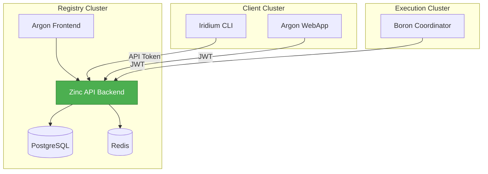

# Zinc Documentation

Zinc is the **Registry Backend** for the CyanPrint platform - an ASP.NET Core API that manages templates, plugins, processors, and users.

## Quick Links

| Section | Description |
|---------|-------------|
| [Developer Documentation](developer/README.md) | Complete developer guide |
| [Getting Started](developer/getting-started/00-README.md) | Run Zinc locally |
| [Features](developer/features/00-README.md) | All features and capabilities |
| [API Reference](developer/surfaces/api/00-README.md) | REST API endpoints |
| [Architecture](developer/architecture/00-README.md) | User flows and key decisions |

## About Zinc

Zinc is part of the **CyanPrint Registry Cluster**, providing:

- **Template Registry** - CRUD for CyanPrint templates with version management
- **Plugin Registry** - Plugin discovery and metadata
- **Processor Registry** - Docker-based processor management
- **User Management** - OAuth2/OIDC via Descope with API token support
- **Search** - Full-text search across all templates

### Tech Stack

- **.NET 8** / ASP.NET Core
- **PostgreSQL** with full-text search (tsvector/tsquery)
- **Entity Framework Core** for data access
- **JWT Bearer Authentication** via Descope
- **OpenTelemetry** for observability
- **Swagger/OpenAPI** for API documentation

### Architecture Position

## Documentation Structure

### Developer Documentation
- [README](developer/README.md) - Overview and quick reference
- [Getting Started](developer/getting-started/00-README.md) - Setup and run locally
- [Features](developer/features/00-README.md) - Complete feature guide
- [API Reference](developer/surfaces/api/00-README.md) - All REST API endpoints
- [Architecture](developer/architecture/00-README.md) - User flows and key decisions

## Related Components

| Component | Description | Link |
|-----------|-------------|------|
| **Argon** | Registry Frontend (SvelteKit) | [../argon/](../argon/) |
| **Iridium** | CyanPrint CLI (Rust) | [../iridium/](../iridium/) |
| **Boron** | Execution Coordinator (Go) | [../boron/](../boron/) |

## Contributing

See [Developer Documentation](developer/) for:
- Code patterns and conventions
- Internal implementation details
- Module architecture
