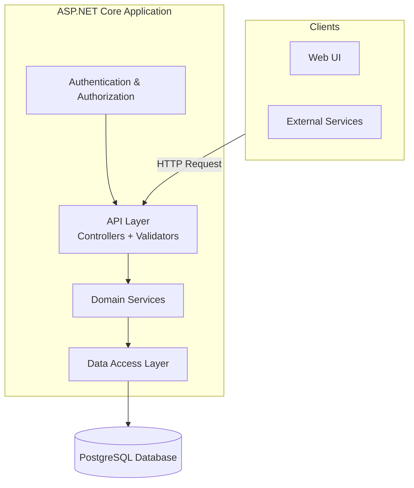
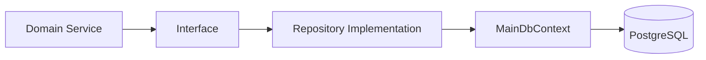
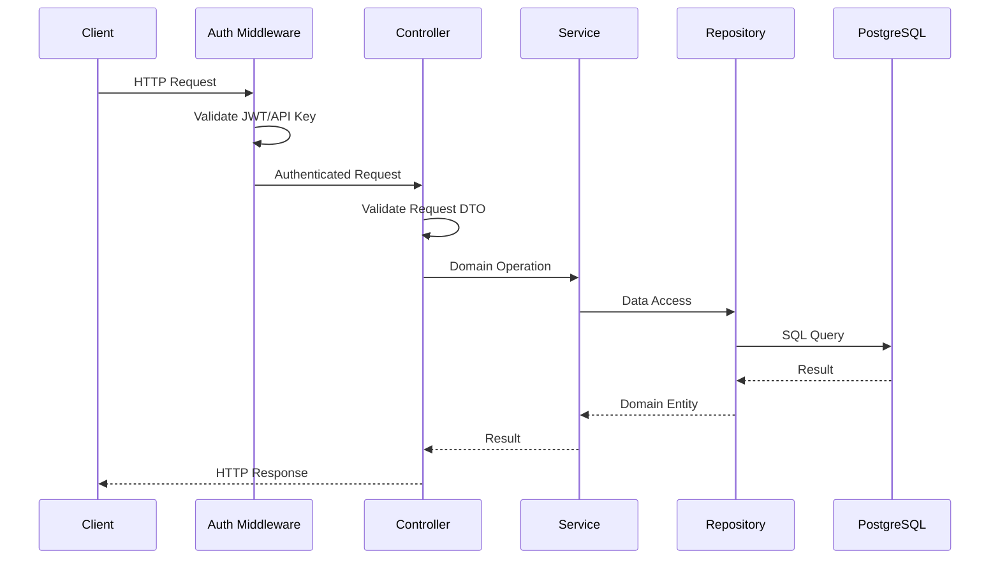

# Zinc Architecture

High-level overview of the Zinc registry backend system.

## System Overview

Zinc is an ASP.NET Core application that provides a REST API for managing CI/CD templates, processors, and plugins. It uses PostgreSQL for persistence and supports dual authentication schemes (JWT + API Keys).

## Main Components

### API Layer

- **Controllers**: Handle HTTP requests/responses
- **Validators**: FluentValidation request validation
- **Mappers**: Convert between DTOs and domain models
- **Error Handling**: Global exception middleware

### Domain Services

- **TemplateService**: Template CRUD and version management
- **UserService**: User account operations
- **TokenService**: API token lifecycle

### Data Layer

- **Entity Framework Core**: ORM for PostgreSQL
- **Repositories**: Data access with transaction handling
- **Migrations**: Database schema versioning

### Authentication

- **Multi-Scheme Authentication**: JWT + API Key
- **Policy-Based Authorization**: HasAny/HasAll scopes
- **Token Generation**: Secure 64-character random strings

## Key Design Decisions

### Dual Authentication Scheme

Zinc supports two authentication methods:

1. **JWT Bearer**: For interactive sessions (Descope OAuth)
2. **API Key**: For service-to-service communication

See [Authentication Feature](./features/01-authentication.md) for details.

### Repository Pattern

Each entity has a dedicated repository interface and implementation:

### Version Management

Templates, processors, and plugins all support versioning with immutable versions. See [Version Concept](./concepts/04-version.md) for details.

### Full-Text Search

PostgreSQL `tsvector` columns enable fast full-text search. See [Full-Text Search Feature](./features/06-full-text-search.md) for details.

## Request Flow

## Related Documentation

- [Concepts](./concepts/) - Domain terminology
- [Features](./features/) - Detailed feature documentation
- [Modules](./modules/) - Code organization
- [API Reference](./surfaces/api/) - HTTP endpoints
