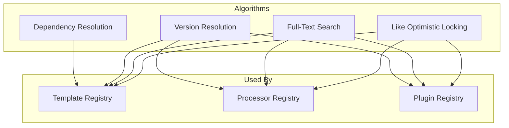

# Algorithms Overview

This section documents complex implementation details and algorithms used in Zinc.

## Algorithms Map

## Algorithm Index

| Algorithm | Used By | Description |
|-----------|---------|-------------|
| [Dependency Resolution](./01-dependency-resolution.md) | Template Version Creation | Validates all referenced versions exist |
| [Version Resolution](./02-version-resolution.md) | All Registries | Query latest and specific versions |
| [Full-Text Search](./03-full-text-search.md) | All Registries | PostgreSQL tsvector search with ranking |
| [Like Optimistic Locking](./04-like-optimistic-locking.md) | All Registries | Race condition detection in like/unlike |

## How to Use This Section

1. **Feature Developers**: Read algorithms to understand implementation details
2. **Contributors**: Reference algorithms when modifying behavior
3. **Reviewers**: Verify algorithm correctness during code review
4. **Troubleshooters**: Understand edge cases and error conditions

## Algorithm Documentation Format

Each algorithm includes:

- **Overview**: What the algorithm does
- **Input/Output**: Data tables
- **Steps**: Detailed walkthrough with sequence diagram
- **Edge Cases**: Table of special cases
- **Error Handling**: Error types and conditions
- **Complexity**: Time and space complexity analysis

## Related Sections

- [Features](../features/) - How algorithms are used
- [Concepts](../concepts/) - Domain terminology
- [Modules](../modules/) - Code organization
