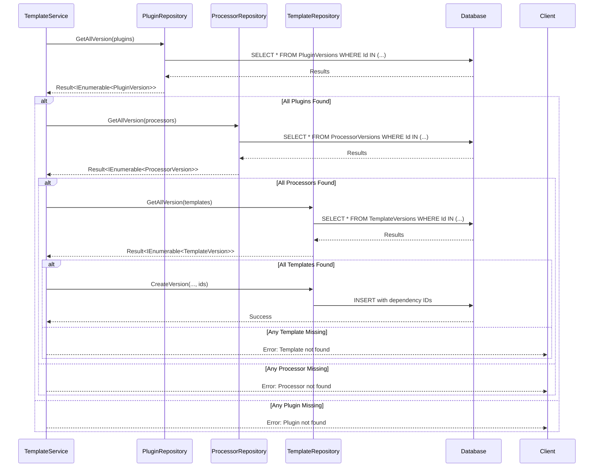

# Dependency Resolution Algorithm

**Used by**:

- [Template Version Creation](../features/03-template-registry.md)

## Overview

Validates that all referenced processor, plugin, and template versions exist before creating a new template version. This ensures template versions never have broken dependencies.

## Input

| Parameter    | Type                               | Description                  |
| ------------ | ---------------------------------- | ---------------------------- |
| `processors` | `IEnumerable<ProcessorVersionRef>` | Processor version references |
| `plugins`    | `IEnumerable<PluginVersionRef>`    | Plugin version references    |
| `templates`  | `IEnumerable<TemplateVersionRef>`  | Template version references  |

Each reference contains:

- `Id` (Guid) - The entity ID
- `Version` (ulong) - The specific version number

## Output

| Result    | Description                                 |
| --------- | ------------------------------------------- |
| `Success` | All dependencies validated, version created |
| `Error`   | One or more dependencies not found          |

## Steps



**Key File**: `Domain/Service/TemplateService.cs:160-196`

## Detailed Logic

```csharp
public async Task<Result<TemplateVersionPrincipal?>> CreateVersion(
    string userId,
    string name,
    TemplateVersionRecord record,
    TemplateVersionProperty? property,
    IEnumerable<ProcessorVersionRef> processors,
    IEnumerable<PluginVersionRef> plugins,
    IEnumerable<TemplateVersionRef> templates
)
{
    // Validate all dependencies exist
    var pluginResults = await plugin.GetAllVersion(plugins);
    var processorResults = await processor.GetAllVersion(processors);
    var templateResults = await repo.GetAllVersion(templates);

    // Combine results using LINQ
    var a = from plugin in pluginResults
            from processor in processorResults
            from template in templateResults
            select (plugin.Select(x => x.Id), processor.Select(x => x.Id), template.Select(x => x.Id));

    return await Task.FromResult(a)
        .ThenAwait(refs =>
        {
            var (pluginIds, processorIds, templateIds) = refs;
            return repo.CreateVersion(userId, name, record, property, processorIds, pluginIds, templateIds);
        });
}
```

**Key File**: `Domain/Service/TemplateService.cs:160-196`

## Edge Cases

| Case               | Input                      | Behavior                              | Key File                              |
| ------------------ | -------------------------- | ------------------------------------- | ------------------------------------- |
| Empty dependencies | `[]`, `[]`, `[]`           | Version created without dependencies  | `TemplateService.cs:160-196`          |
| Missing processor  | Invalid processor ID       | Returns error before creating version | `PluginRepository.GetAllVersion()`    |
| Missing plugin     | Invalid plugin ID          | Returns error before creating version | `ProcessorRepository.GetAllVersion()` |
| Missing template   | Invalid template ID        | Returns error before creating version | `TemplateRepository.GetAllVersion()`  |
| Self-reference     | Template references itself | Not explicitly prevented              | N/A                                   |
| Circular reference | A→B→A                      | Not explicitly prevented              | N/A                                   |

## Error Handling

| Error            | Cause                            | Handling                           |
| ---------------- | -------------------------------- | ---------------------------------- |
| `EntityNotFound` | Referenced version doesn't exist | Returns error, version not created |
| Database error   | Query failure                    | Returns error, version not created |

## Complexity

| Aspect    | Complexity                                              |
| --------- | ------------------------------------------------------- |
| **Time**  | O(n + m + p) where n=plugins, m=processors, p=templates |
| **Space** | O(n + m + p) for loading all versions                   |

## Related

- [Dependency Concept](../concepts/05-dependency.md) - Dependency relationships
- [Template Version Creation](../features/03-template-registry.md) - Feature usage
