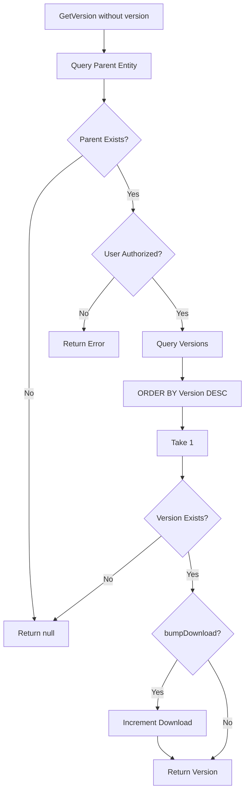
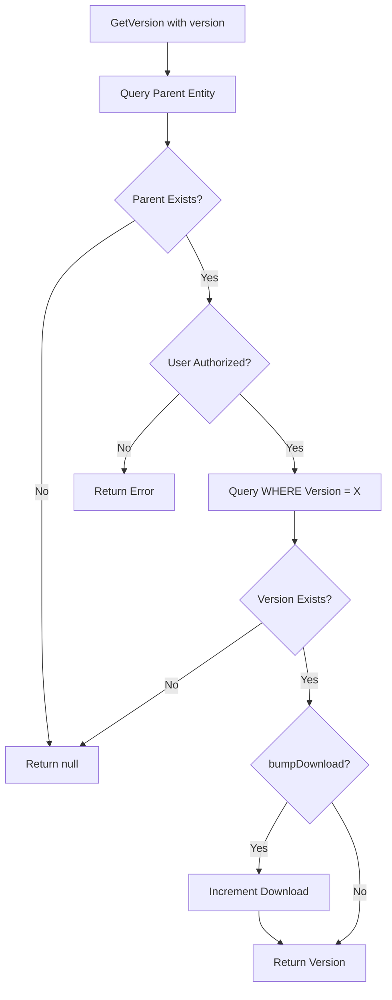
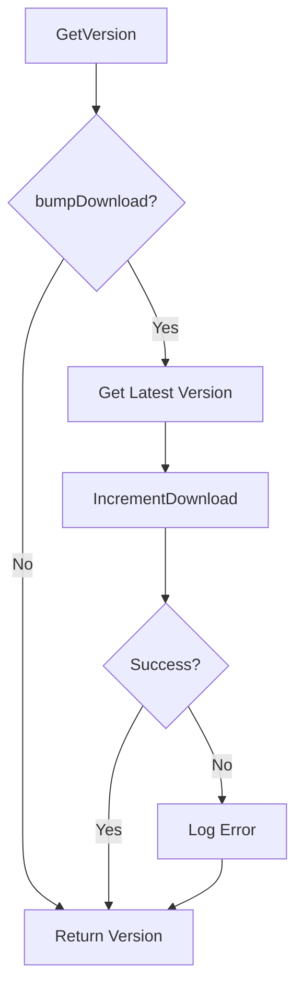

# Version Resolution Algorithm

**Used by**:

- [Template Registry](../features/03-template-registry.md)
- [Processor Registry](../features/04-processor-registry.md)
- [Plugin Registry](../features/05-plugin-registry.md)

## Overview

Resolves template, processor, and plugin versions by querying the database. Supports getting the latest version (highest version number) or a specific version.

## Input

| Parameter            | Type           | Description                 |
| -------------------- | -------------- | --------------------------- |
| `userId`             | string         | User ID (for authorization) |
| `parentIdentifier`   | Guid or string | Parent entity ID or slug    |
| `version` (optional) | ulong          | Specific version number     |

> **Note**: `userId` is used for authorization at the controller layer before the service is invoked.

## Output

| Result                                           | Description                    |
| ------------------------------------------------ | ------------------------------ |
| `TemplateVersion/ProcessorVersion/PluginVersion` | Requested version entity       |
| `null`                                           | Version not found              |
| `Error`                                          | Authorization or query failure |

## Steps

<!--
NOTE: The CheckAuth step in these flowcharts represents the conceptual authorization check that occurs during the version resolution flow.
While the actual authorization is enforced at the controller layer (via [Authorize] attributes) before the service is called,
these flowcharts show the complete request flow from a client perspective. The diagrams are intentionally inclusive of auth
to help developers understand the full sequence of checks, regardless of which layer performs them.
-->

### Get Latest Version



**Key File**: `Domain/Service/TemplateService.cs:117-148`

### Get Specific Version



**Key File**: `Domain/Service/TemplateService.cs:82-115`

## Detailed Logic

### Latest Version Query

```csharp
public async Task<Result<TemplateVersion?>> GetVersion(
    string username,
    string name,
    bool bumpDownload
)
{
    if (bumpDownload)
    {
        return await repo.GetVersion(username, name)
            .DoAwait(
                DoType.Ignore,
                async _ =>
                {
                    var r = await repo.IncrementDownload(username, name);
                    if (r.IsFailure())
                    {
                        logger.LogError(
                            r.FailureOrDefault(),
                            "Failed to increment download for Template '{Username}/{Name}'",
                            username, name
                        );
                    }
                    return r;
                }
            );
    }
    return await repo.GetVersion(username, name);
}
```

**Key File**: `Domain/Service/TemplateService.cs:117-148`

### Specific Version Query

```csharp
public async Task<Result<TemplateVersion?>> GetVersion(
    string username,
    string name,
    int version
)
{
    var result = await db.TemplateVersions
        .Include(x => x.Template)
        .ThenInclude(x => x.User)
        .Where(x => x.Template.User.Username == username
            && x.Template.Name == name
            && x.Version == version)
        .FirstOrDefaultAsync();

    return result?.ToDomain() ?? (TemplateVersion?)null;
}
```

**Key File**: `App/Modules/Cyan/Data/Repositories/TemplateRepository.cs`

### Repository Query (Latest Version)

```csharp
public async Task<TemplateVersion?> GetVersion(string username, string name)
{
    var query = db.TemplateVersions
        .Include(x => x.Template)
        .ThenInclude(x => x.User)
        .Where(x => x.Template.User.Username == username && x.Template.Name == name)
        .OrderByDescending(x => x.Version)
        .Take(1);

    var result = await query.FirstOrDefaultAsync();
    return result?.ToDomain();
}
```

**Key File**: `App/Modules/Cyan/Data/Repositories/TemplateRepository.cs`

## Edge Cases

| Case                       | Input                         | Behavior                           | Key File                       |
| -------------------------- | ----------------------------- | ---------------------------------- | ------------------------------ |
| Parent not found           | Invalid username/name         | Returns `null`                     | `TemplateRepository.cs:95-122` |
| No versions                | Valid parent, no versions     | Returns `null`                     | `TemplateRepository.cs`        |
| Specific version not found | Valid parent, invalid version | Returns `null`                     | `TemplateRepository.cs`        |
| Download increment fails   | Database error                | Logs error, returns version anyway | `TemplateService.cs:131-142`   |

## Download Bumping

When `bumpDownload=true`, the download count is incremented:



**Key File**: `App/Modules/Cyan/Data/Repositories/TemplateRepository.cs:341-368`

## Error Handling

| Error                    | Cause                       | Handling                          |
| ------------------------ | --------------------------- | --------------------------------- |
| `null` result            | Parent or version not found | Returns `null` to caller          |
| Database error           | Query failure               | Returns error result              |
| Download increment error | Update failure              | Logs error, continues with return |

## Complexity

| Aspect              | Complexity                               |
| ------------------- | ---------------------------------------- |
| **Time (latest)**   | O(1) with index on `(ParentId, Version)` |
| **Time (specific)** | O(1) with index on `(ParentId, Version)` |
| **Space**           | O(1) for single result                   |

## Related

- [Version Concept](../concepts/04-version.md) - Version management
- [Full-Text Search](./03-full-text-search.md) - Search-based resolution
