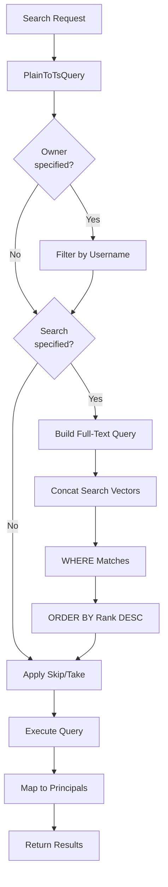

# Full-Text Search Algorithm

**Used by**:

- [Template Registry](../features/03-template-registry.md)
- [Processor Registry](../features/04-processor-registry.md)
- [Plugin Registry](../features/05-plugin-registry.md)

## Overview

PostgreSQL full-text search using `tsvector` columns and GIN indexes. Supports searching across name, description, tags, and username with relevance ranking.

## Input

| Parameter          | Type   | Description                  |
| ------------------ | ------ | ---------------------------- |
| `search`           | string | Full-text search query       |
| `skip`             | int    | Results to skip (pagination) |
| `limit`            | int    | Maximum results to return    |
| `owner` (optional) | string | Filter by username           |

## Output

| Result                   | Description           |
| ------------------------ | --------------------- |
| `IEnumerable<Principal>` | Ranked search results |
| `Error`                  | Query failure         |

## Steps



**Key File**: `App/Modules/Cyan/Data/Repositories/TemplateRepository.cs:20-64`

## Detailed Logic

### Search Query Construction

```csharp
public async Task<Result<IEnumerable<TemplatePrincipal>>> Search(TemplateSearch search)
{
    var templates = db.Templates.AsQueryable();

    // Filter by owner
    if (search.Owner != null)
        templates = templates.Include(x => x.User)
            .Where(x => x.User.Username == search.Owner);

    // Full-text search
    if (search.Search != null)
    {
        templates = templates
            .Include(x => x.User)
            .Where(x =>
                // Full-text search with tsvector
                x.SearchVector
                    .Concat(EF.Functions.ToTsVector("english", x.User.Username))
                    .Concat(EF.Functions.ArrayToTsVector(x.Tags))
                    .Matches(EF.Functions.PlainToTsQuery("english", search.Search.Replace("/", " ")))
                || EF.Functions.ILike(x.Name, $"%{search.Search}%")
                || EF.Functions.ILike(x.User.Username, $"%{search.Search}%")
            )
            // Rank by relevance (highest first)
            .OrderByDescending(x =>
                x.SearchVector
                    .Concat(EF.Functions.ToTsVector("english", x.User.Username))
                    .Concat(EF.Functions.ArrayToTsVector(x.Tags))
                    .Rank(EF.Functions.PlainToTsQuery("english", search.Search.Replace("/", " ")))
            );
    }

    // Pagination
    templates = templates.Skip(search.Skip).Take(search.Limit);

    var results = await templates.ToArrayAsync();
    return results.Select(x => x.ToPrincipal()).ToResult();
}
```

**Key File**: `App/Modules/Cyan/Data/Repositories/TemplateRepository.cs:20-64`

### TsVector Generation

Search vectors are auto-generated by PostgreSQL triggers:

```sql
-- Generated from Name, Description, Readme
SearchVector = to_tsvector('english',
    coalesce(Name, '') || ' ' ||
    coalesce(Description, '') || ' ' ||
    coalesce(Readme, '')
)
```

### Query Transformation

1. **Input**: `search = "ci/docker"`
2. **Transform**: Replace `/` with space → `"ci docker"`
3. **ToTsQuery**: Converts to PostgreSQL tsquery format
4. **Matches**: `@@` operator checks for matches

## Edge Cases

| Case               | Input                   | Behavior                        | Key File                       |
| ------------------ | ----------------------- | ------------------------------- | ------------------------------ |
| Empty search       | `search = ""` or `null` | Returns all (paginated) results | `TemplateRepository.cs:33`     |
| Special characters | `search = "user/repo"`  | Replaced with spaces            | `TemplateRepository.cs:40, 46` |
| No matches         | Valid query, no results | Returns empty array             | `TemplateRepository.cs:52`     |
| Filter by owner    | `owner = "alice"`       | Filters to user's templates     | `TemplateRepository.cs:30-32`  |

## Indexing

GIN indexes provide fast lookups:

```csharp
modelBuilder.Entity<TemplateData>(entity =>
{
    entity.HasIndex(x => x.SearchVector)
        .HasMethod("GIN")
        .IsTsVector();
});
```

**Key File**: `App/StartUp/Database/MainDbContext.cs:86-92`

## Search Fields

| Field         | Processing          | Purpose              |
| ------------- | ------------------- | -------------------- |
| `Name`        | `ToTsVector()`      | Name matching        |
| `Description` | `ToTsVector()`      | Description matching |
| `Readme`      | `ToTsVector()`      | Readme matching      |
| `Tags`        | `ArrayToTsVector()` | Tag matching         |
| `Username`    | `ToTsVector()`      | Owner matching       |

## Error Handling

| Error          | Cause                   | Handling                         |
| -------------- | ----------------------- | -------------------------------- |
| Database error | Query failure           | Returns error result             |
| Invalid query  | Malformed search string | PostgreSQL returns empty results |

## Complexity

| Aspect    | Complexity              |
| --------- | ----------------------- |
| **Time**  | O(log n) with GIN index |
| **Space** | O(k) where k = limit    |

## PostgreSQL Functions Used

| Function                          | Purpose                        |
| --------------------------------- | ------------------------------ |
| `ToTsVector('english', text)`     | Convert text to tsvector       |
| `ArrayToTsVector(array)`          | Convert array to tsvector      |
| `PlainToTsQuery('english', text)` | Convert search text to tsquery |
| `tsvector @@ tsquery`             | Check for match                |
| `ts_rank(tsvector, tsquery)`      | Calculate relevance score      |
| `\|\|` (concat)                   | Combine tsvectors              |

**Key File**: `App/Modules/Cyan/Data/Repositories/TemplateRepository.cs:38-48`

## Related

- [Full-Text Search Feature](../features/06-full-text-search.md) - Feature implementation
- [Database Configuration](../modules/01-startup.md#database-setup) - DbContext setup
