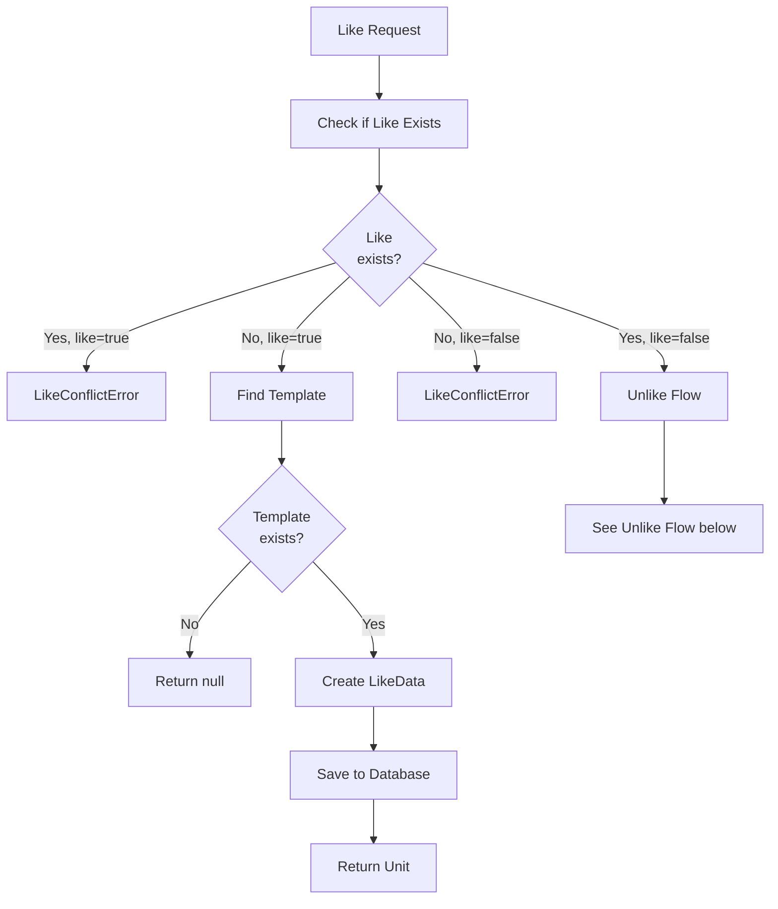
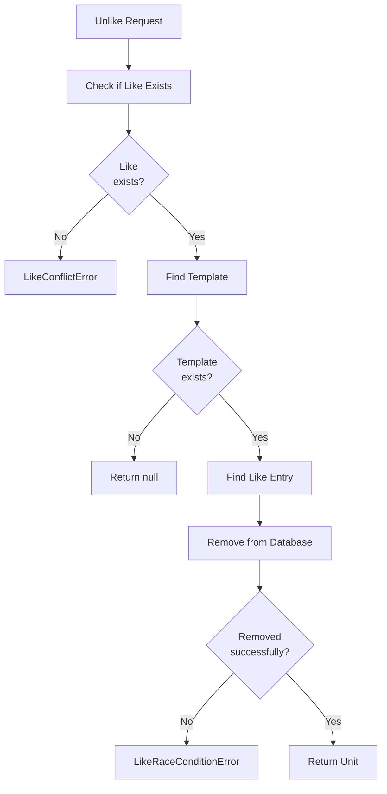

# Like Optimistic Locking Algorithm

**Used by**:

- [Template Registry](../features/03-template-registry.md)
- [Processor Registry](../features/04-processor-registry.md)
- [Plugin Registry](../features/05-plugin-registry.md)

## Overview

Implements optimistic locking to handle concurrent like/unlike operations. Detects race conditions when multiple users try to like/unlike the same entity simultaneously.

## Input

| Parameter  | Type    | Description                        |
| ---------- | ------- | ---------------------------------- |
| `likerId`  | string  | User ID performing the like/unlike |
| `username` | string  | Owner's username                   |
| `name`     | string  | Entity name                        |
| `like`     | boolean | `true` to like, `false` to unlike  |

## Output

| Result                   | Description                            |
| ------------------------ | -------------------------------------- |
| `Success`                | Like/unlike completed                  |
| `LikeConflictError`      | State conflict (already liked/unliked) |
| `LikeRaceConditionError` | Race condition detected                |

## Steps

### Like (Create) Flow



### Unlike (Delete) Flow



**Key File**: `App/Modules/Cyan/Data/Repositories/TemplateRepository.cs:258-339`

## Detailed Logic

```csharp
public async Task<Result<Unit?>> Like(
    string likerId,
    string username,
    string name,
    bool like
)
{
    // Check if like already exists
    var likeExist = await db.TemplateLikes
        .Include(x => x.Template)
        .ThenInclude(x => x.User)
        .AnyAsync(x =>
            x.UserId == likerId &&
            x.Template.User.Username == username &&
            x.Template.Name == name
        );

    // Conflict check
    if (like == likeExist)
    {
        return new LikeConflictError(
            "Failed to like templates",
            $"{username}/{name}",
            "template",
            like ? "like" : "unlike"
        ).ToException();
    }

    // Find template
    var p = await db.Templates
        .Include(x => x.User)
        .FirstOrDefaultAsync(x => x.User.Username == username && x.Name == name);

    if (p == null)
        return (Unit?)null;

    // Like or Unlike
    if (like)
    {
        var l = new TemplateLikeData
        {
            UserId = likerId,
            User = null!,
            TemplateId = p.Id,
            Template = null!,
        };
        db.TemplateLikes.Add(l);
        await db.SaveChangesAsync();
        return new Unit();
    }
    else
    {
        var l = await db.TemplateLikes
            .FirstOrDefaultAsync(x => x.UserId == likerId && x.TemplateId == p.Id);

        // Race condition check
        if (l == null)
        {
            return new LikeRaceConditionError(
                "Failed to like templates",
                $"{username}/{name}",
                "template",
                like ? "like" : "unlike"
            ).ToException();
        }

        db.TemplateLikes.Remove(l with { Template = null!, User = null! });
        await db.SaveChangesAsync();
        return new Unit();
    }
}
```

**Key File**: `App/Modules/Cyan/Data/Repositories/TemplateRepository.cs:258-339`

## Edge Cases

| Case                     | Input                                  | Behavior                         | Key File                        |
| ------------------------ | -------------------------------------- | -------------------------------- | ------------------------------- |
| Like already liked       | `like=true`, already exists            | Returns `LikeConflictError`      | `TemplateRepository.cs:270-276` |
| Unlike not liked         | `like=false`, doesn't exist            | Returns `LikeConflictError`      | `TemplateRepository.cs:270-276` |
| Race condition on unlike | Entry removed between check and delete | Returns `LikeRaceConditionError` | `TemplateRepository.cs:304-318` |
| Template not found       | Invalid username/name                  | Returns `null`                   | `TemplateRepository.cs:278-283` |

## Error Types

### LikeConflictError

```csharp
public class LikeConflictError : UserError
{
    public LikeConflictError(string title, string target, string type, string action)
        : base(
            $"Failed to {action} {type}",
            $"The {type} '{target}' is already {action}ed"
        )
    { }
}
```

**Key File**: `App/Error/V1/LikeConflict.cs`

### LikeRaceConditionError

```csharp
public class LikeRaceConditionError : UserError
{
    public LikeRaceConditionError(string title, string target, string type, string action)
        : base(
            $"Failed to {action} {type}",
            $"Race condition detected: {type} '{target}' state changed during operation"
        )
    { }
}
```

**Key File**: `App/Error/V1/LikeRaceCondition.cs`

## Error Handling

| Error                    | Cause                                    | HTTP Status               | Key File                        |
| ------------------------ | ---------------------------------------- | ------------------------- | ------------------------------- |
| `LikeConflictError`      | Like/unlike conflicts with current state | 409 Conflict              | `LikeConflict.cs`               |
| `LikeRaceConditionError` | Race condition detected                  | 500 Internal Server Error | `LikeRaceCondition.cs`          |
| `null`                   | Template not found                       | 404 Not Found             | `TemplateRepository.cs:282-283` |

## Uniqueness Constraint

Database ensures one like per user per entity:

```sql
UNIQUE ("UserId", "TemplateId")
UNIQUE ("UserId", "PluginId")
UNIQUE ("UserId", "ProcessorId")
```

## Complexity

| Aspect    | Complexity                 |
| --------- | -------------------------- |
| **Time**  | O(1) with unique index     |
| **Space** | O(1) for single like entry |

## Related

- [Like Concept](../concepts/06-like.md) - Like system concept
- [Like System Feature](../features/07-like-system.md) - Feature implementation
