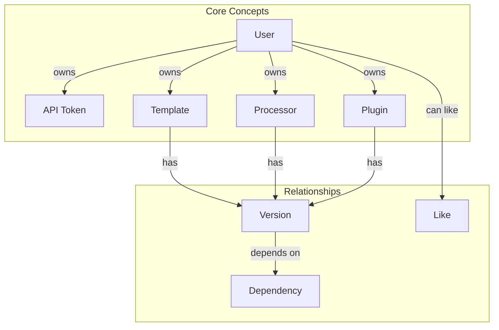
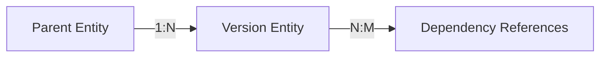
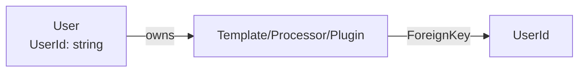

# Concepts Overview

This section explains the domain terminology and foundational concepts used in Zinc.

## Concepts Map

## Concept Index

| Concept | Description | Related |
|---------|-------------|---------|
| [Authentication](./01-authentication.md) | JWT and API Key authentication methods | [Authorization](./02-authorization.md) |
| [Authorization](./02-authorization.md) | Scope-based access control | [Authentication](./01-authentication.md) |
| [Registry](./03-registry.md) | Template/Processor/Plugin containers | [Version](./04-version.md) |
| [Version](./04-version.md) | Auto-incrementing version numbers | [Dependency](./05-dependency.md) |
| [Dependency](./05-dependency.md) | Cross-version references | [Version](./04-version.md) |
| [Like](./06-like.md) | User-to-entity association | [Registry](./03-registry.md) |

## How Concepts Relate

### Authentication & Authorization

1. **Authentication** verifies who you are (JWT or API Token)
2. **Authorization** determines what you can do (scope-based policies)

### Registries & Versions

- A **Registry** entity (Template/Processor/Plugin) contains metadata
- Multiple **Versions** belong to one Registry entity
- **Dependencies** reference specific versions of other entities

## Key Patterns

### Separation of Concerns

Each domain model has multiple representations:

| Type | Purpose | Example |
|------|---------|---------|
| `*Data` | Database entity | `TemplateData` |
| `*Principal` | API response (light) | `TemplatePrincipal` |
| `*Record` | Identity fields | `TemplateRecord` |
| `*Metadata` | Editable fields | `TemplateMetadata` |

### Version Management

All versioned entities follow the same pattern:

- Version numbers are `ulong` auto-increment
- Dependencies reference specific versions
- Latest version is determined by querying

### Ownership Model

Users own registry entities through foreign key relationships:

## Related Sections

- [Features](../features/) - How concepts are implemented
- [Algorithms](../algorithms/) - Implementation details
- [API](../surfaces/api/) - HTTP contracts
