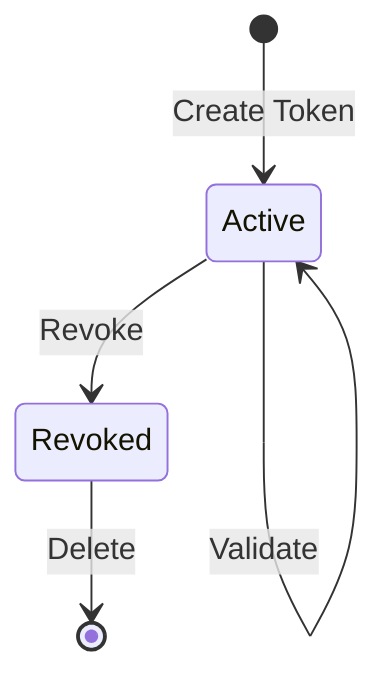

# Authentication Concept

**What**: Dual authentication scheme supporting both JWT (Descope OAuth) and API Keys.
**Why**: Enables both interactive user sessions and service-to-service automation.

## Authentication Methods

Zinc supports two authentication schemes:

### JWT Bearer Authentication

- **Provider**: Descope OAuth
- **Validation**: JWKS endpoint verification
- **Use Case**: Interactive user sessions via Web UI
- **Key File**: `App/StartUp/Services/AuthService.cs:41-65`

### API Key Authentication

- **Format**: 64-character random alphanumeric string
- **Storage**: Plaintext in database with revocation flag
- **Validation**: Database lookup against active tokens
- **Use Case**: Service-to-service automation (CLI, CI/CD)
- **Key File**: `App/Modules/Users/API/Auth/ApiKeyAuthenticationOptions.cs:15-50`

## Scheme Selection

The authentication scheme is automatically selected based on request headers:

- **Authorization: Bearer** header → JWT Bearer Scheme
- **No Authorization header** → API Key Scheme (checks X-API-TOKEN)

**Key File**: `App/StartUp/Services/AuthService.cs:70-86`

## API Token Format

- **Type**: 64-character random alphanumeric string
- **Generation**: `PasswordGenerator` library with lowercase, uppercase, numeric
- **Key File**: `Domain/Service/ApiKeyGenerator.cs:7-15`

**Example**: `aB1cD2eF3gH4iJ5kL6mN7oP8qR9sT0uV1wX2yZ3aB4cD5eF6gH7iJ8kL9mN0oP`

## Token Lifecycle

## Related

- [Authentication Feature](../features/01-authentication.md) - Implementation details, flows, and edge cases
- [Token Management Feature](../features/08-token-management.md) - Token CRUD operations
- [Authorization Concept](./02-authorization.md) - How authenticated users are authorized
