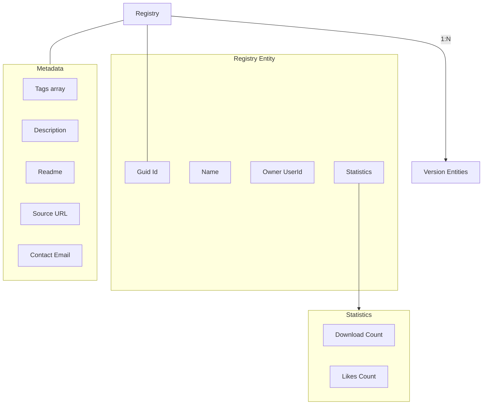
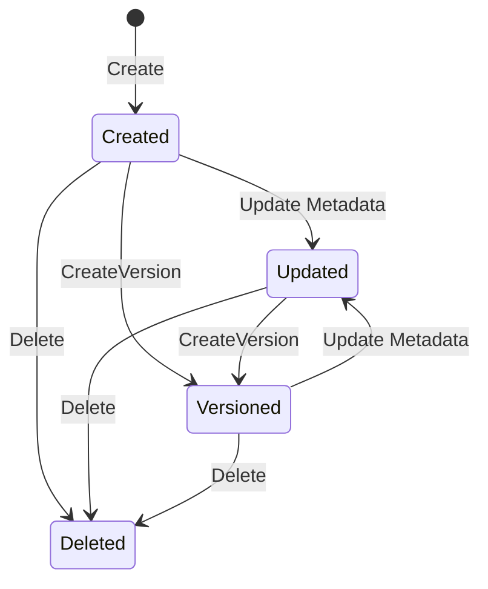

# Registry Concept

**What**: A container entity for versioned CI/CD artifacts (templates, processors, plugins).
**Why**: Separates metadata from version-specific implementation details.

## Registry Entities

Zinc manages three types of registries:

| Type          | Purpose                    | Key Files                                       |
| ------------- | -------------------------- | ----------------------------------------------- |
| **Template**  | CI/CD pipeline definitions | `App/Modules/Cyan/Data/Models/TemplateData.cs`  |
| **Processor** | Data processing components | `App/Modules/Cyan/Data/Models/ProcessorData.cs` |
| **Plugin**    | Extensible functionality   | `App/Modules/Cyan/Data/Models/PluginData.cs`    |

## Registry Structure

All registries follow the same structure:

## Registry vs Version

| Aspect           | Registry          | Version                                |
| ---------------- | ----------------- | -------------------------------------- |
| **Identity**     | Name + Owner      | Version Number                         |
| **Mutability**   | Metadata editable | Content immutable (metadata updatable) |
| **Dependencies** | None              | References other versions              |
| **Docker Ref**   | None              | Image + Tag                            |

**Example**:

- Registry: `alice/my-pipeline`
- Versions: `v1`, `v2`, `v3`
- Latest: Determined by highest version number

## Ownership Model

- Created by user with valid authentication
- Only owner can edit metadata
- Anyone can view public registries
- Likes are tracked per-user

## Full-Text Search

Registry entities support full-text search via PostgreSQL `tsvector`.

**Key File**: `App/Modules/Cyan/Data/Repositories/TemplateRepository.cs:34-49`

## Registry Lifecycle

## Naming Convention

Registry entities are identified by `{owner}/{name}`:

- Format: `alice/my-pipeline`
- Owner: User's username
- Name: Registry-specific name (unique per user)
- Lookup: Via username + name or GUID

**Key File**: `App/Modules/Cyan/Data/Repositories/TemplateRepository.cs:95-122`

## Related Concepts

- [Version](./04-version.md) - Version management within registries
- [Dependency](./05-dependency.md) - Cross-version references
- [Template Registry Feature](../features/03-template-registry.md) - Implementation details
- [Processor Registry Feature](../features/04-processor-registry.md) - Implementation details
- [Plugin Registry Feature](../features/05-plugin-registry.md) - Implementation details
