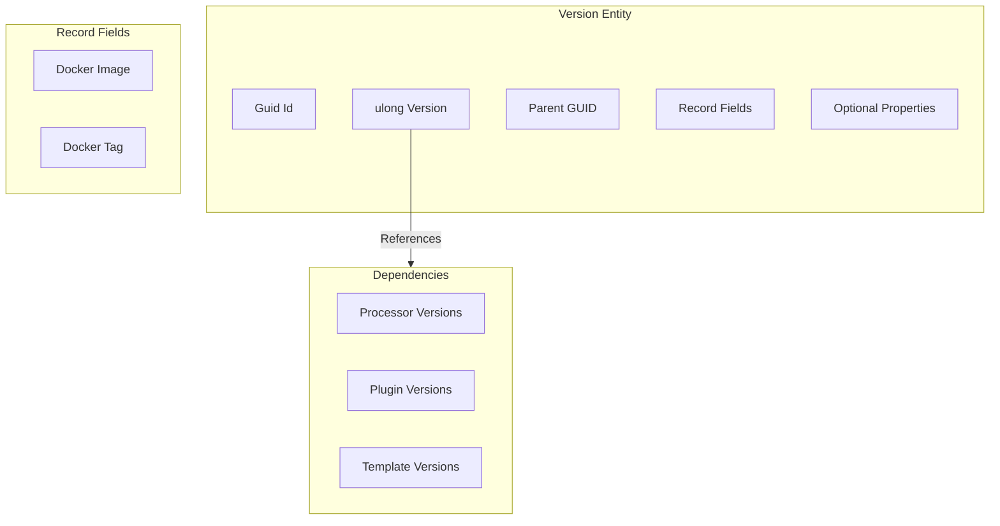
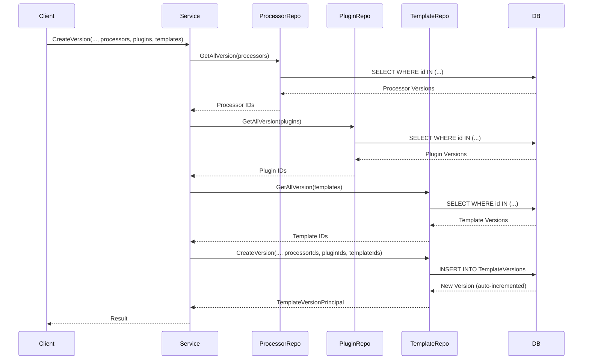
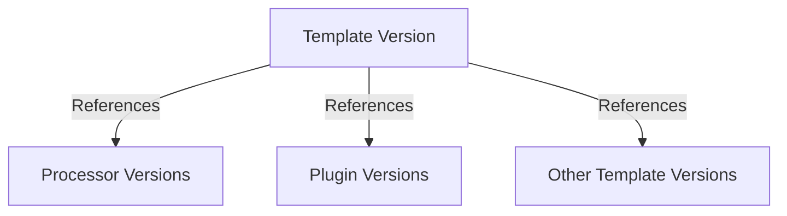
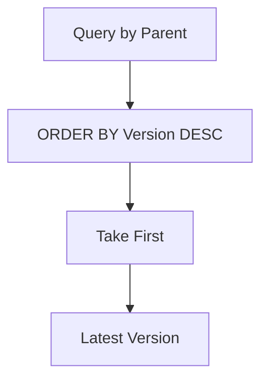
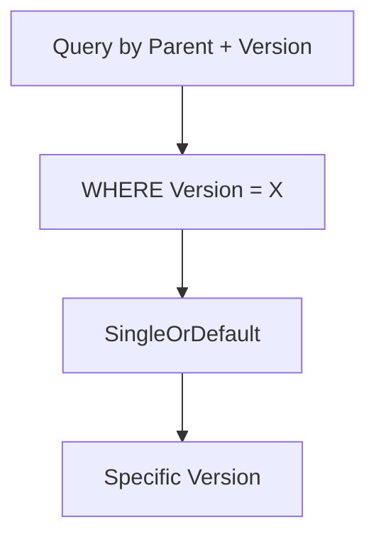
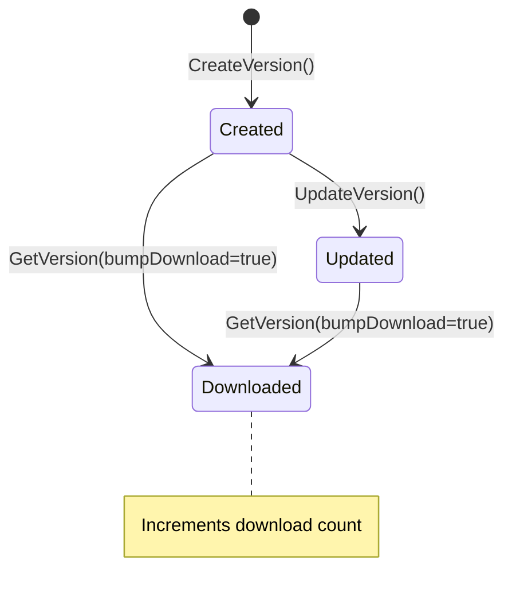
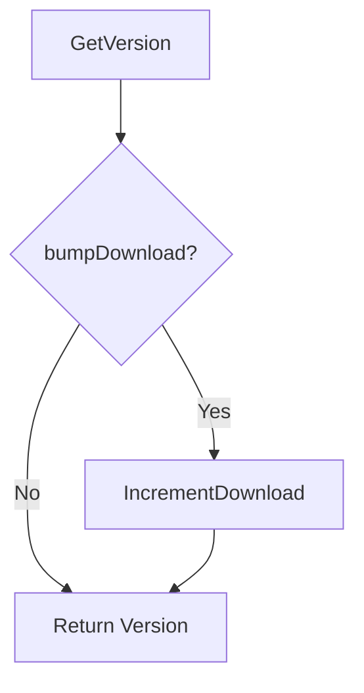

# Version Concept

**What**: Auto-incrementing `ulong` version numbers for registry entities.
**Why**: Enables immutable version tracking and dependency resolution.

**Important**: Previous documentation incorrectly described versions as semver-encoded.

## Actual Version Format

- **Type**: `ulong` (simple integer)
- **Pattern**: Auto-increment starting from 1
- **Uniqueness**: Unique per parent entity (Id + Version)
- **Immutability**: Once created, versions cannot be modified

**Example**:

```
my-template: v1, v2, v3, v4, ...
```

**NOT (Previous Incorrect Docs)**:

- ❌ `major*256^2 + minor*256 + patch` - Semver encoding was never implemented
- ❌ Semantic versioning - Versions are simple incrementing integers

## Version Structure

All versioned entities follow the same structure:



## Version Models

| Entity    | Version Data Model     | Key File                                               |
| --------- | ---------------------- | ------------------------------------------------------ |
| Template  | `TemplateVersionData`  | `App/Modules/Cyan/Data/Models/TemplateVersionData.cs`  |
| Processor | `ProcessorVersionData` | `App/Modules/Cyan/Data/Models/ProcessorVersionData.cs` |
| Plugin    | `PluginVersionData`    | `App/Modules/Cyan/Data/Models/PluginVersionData.cs`    |

## Version Creation Flow



**Key File**: `Domain/Service/TemplateService.cs:160-196`

## Version References

Versions can reference specific versions of other entities:



### Reference Tables

| From             | To                | Junction Table          |
| ---------------- | ----------------- | ----------------------- |
| Template Version | Processor Version | `TemplateProcessorData` |
| Template Version | Plugin Version    | `TemplatePluginData`    |
| Template Version | Template Version  | `TemplateTemplateData`  |

## Version Resolution

### Get Latest Version



**Key File**: `App/Modules/Cyan/Data/Repositories/TemplateRepository.cs:370-400`

### Get Specific Version



**Key File**: `App/Modules/Cyan/Data/Repositories/TemplateRepository.cs:95-122`

## Version Lifecycle



## Download Tracking

Versions track download counts:



**Key File**: `Domain/Service/TemplateService.cs:82-115`

## Version Properties

Optional properties can be attached to versions:

| Property      | Type   | Purpose                   |
| ------------- | ------ | ------------------------- |
| `Description` | string | Version-specific notes    |
| `DockerImage` | string | Container image reference |
| `DockerTag`   | string | Container image tag       |

**Key File**: `Domain/Model/TemplateVersion.cs` → `TemplateVersionProperty`

## Related Concepts

- [Registry](./03-registry.md) - Parent container entities
- [Dependency](./05-dependency.md) - Cross-version references
- [Dependency Resolution Algorithm](../algorithms/01-dependency-resolution.md) - Implementation details
- [Version Resolution Algorithm](../algorithms/02-version-resolution.md) - Query patterns
