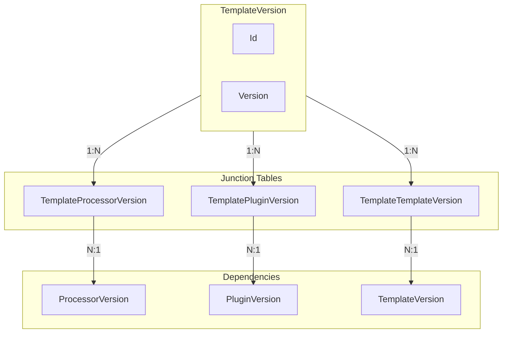
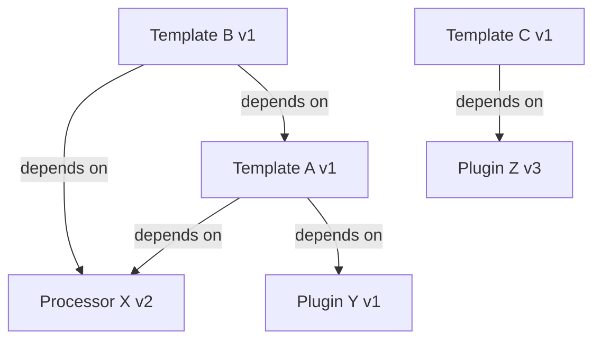

# Dependency Concept

**What**: Cross-version references between templates, processors, and plugins.
**Why**: Enables reproducible builds by locking to specific versions.

## Dependency Types

Templates can depend on:

| Dependency Type | From             | To                | Purpose                    |
| --------------- | ---------------- | ----------------- | -------------------------- |
| Processor       | Template Version | Processor Version | Data processing components |
| Plugin          | Template Version | Plugin Version    | Extensible functionality   |
| Template        | Template Version | Template Version  | Template composition       |

## Dependency Reference Format

Dependencies are specified as version references:

```csharp
public class ProcessorVersionRef
{
    public Guid ProcessorId { get; set; }
    public ulong Version { get; set; }
}

public class PluginVersionRef
{
    public Guid PluginId { get; set; }
    public ulong Version { get; set; }
}

public class TemplateVersionRef
{
    public Guid TemplateId { get; set; }
    public ulong Version { get; set; }
}
```

## Junction Tables

Dependencies are stored in junction tables:



**Key Files**:

- `App/Modules/Cyan/Data/Models/TemplateProcessorData.cs`
- `App/Modules/Cyan/Data/Models/TemplatePluginData.cs`
- `App/Modules/Cyan/Data/Models/TemplateTemplateData.cs`

## Dependency Graph

Templates form a directed graph structure:

<!--
NOTE: While templates conceptually form a DAG, circular references are not explicitly
prevented at the database level. The dependency resolution algorithm only validates
that referenced entities exist. Cycle detection should be added before implementing
graph-traversal tooling to prevent infinite loops.
-->



## Dependency Validation

For the validation algorithm and flow, see [Dependency Resolution Algorithm](../algorithms/01-dependency-resolution.md).

## Related Concepts

- [Version](./04-version.md) - Version management
- [Registry](./03-registry.md) - Container entities
- [Dependency Resolution Algorithm](../algorithms/01-dependency-resolution.md) - Validation implementation
