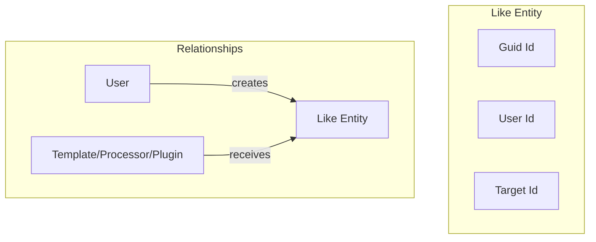
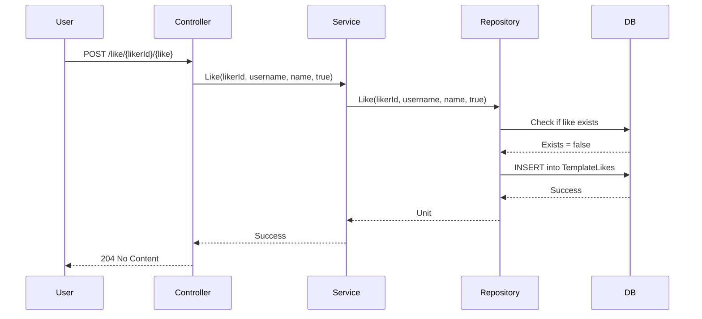
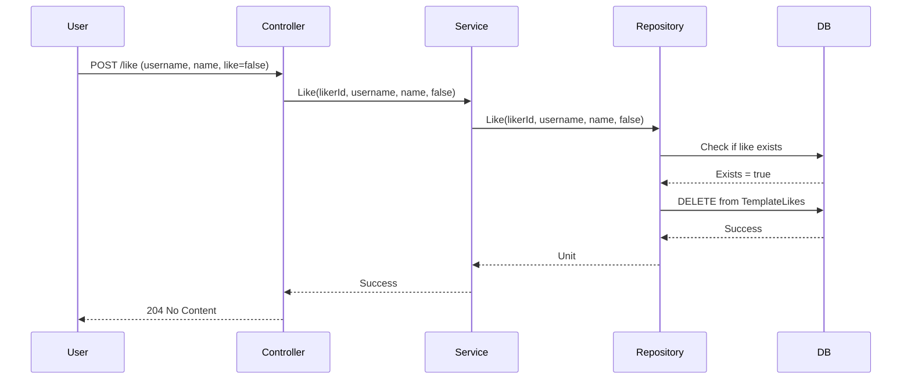
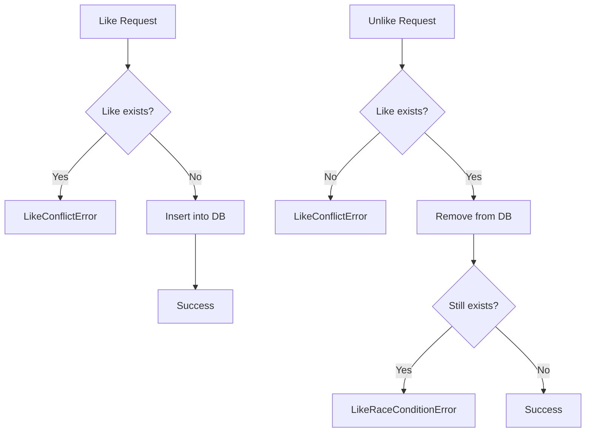
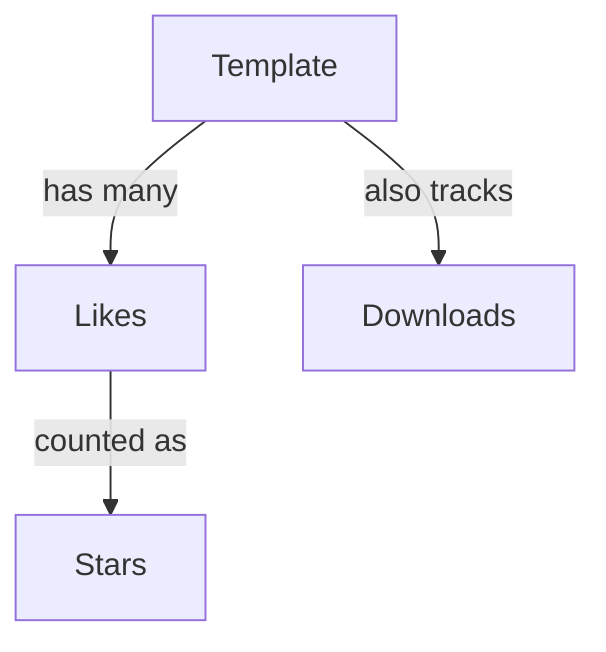

# Like Concept

**What**: User-to-entity association for bookmarking/favoriting.
**Why**: Allows users to track and discover popular templates, processors, and plugins.

## Like Entities

Each registry type has its own Like entity:

| Like Entity         | Target    | Key File                                         |
| ------------------- | --------- | ------------------------------------------------ |
| `TemplateLikeData`  | Template  | `App/Modules/Cyan/Data/Models/LikeData.cs:5-14`  |
| `PluginLikeData`    | Plugin    | `App/Modules/Cyan/Data/Models/LikeData.cs:16-25` |
| `ProcessorLikeData` | Processor | `App/Modules/Cyan/Data/Models/LikeData.cs:27-36` |

## Like Structure



**Example**:

```csharp
public record TemplateLikeData
{
    public Guid Id { get; set; }
    public Guid TemplateId { get; set; }
    public TemplateData Template { get; set; } = null!;
    public string UserId { get; set; } = string.Empty;
    public UserData User { get; set; } = null!;
}
```

## Uniqueness Constraint

Each user can like an entity only once:

```sql
UNIQUE ("UserId", "TemplateId")
UNIQUE ("UserId", "PluginId")
UNIQUE ("UserId", "ProcessorId")
```

## Like Operations

### Like (Create)



**Key File**: `App/Modules/Cyan/Data/Repositories/TemplateRepository.cs:258-298`

### Unlike (Delete)



**Key File**: `App/Modules/Cyan/Data/Repositories/TemplateRepository.cs:299-325`

## Optimistic Locking

Likes use optimistic locking to handle race conditions:



**Edge Cases**:

| Case                     | Behavior      | Error                    |
| ------------------------ | ------------- | ------------------------ |
| Like already liked       | Returns error | `LikeConflictError`      |
| Unlike not liked         | Returns error | `LikeConflictError`      |
| Race condition on unlike | Returns error | `LikeRaceConditionError` |

**Key File**: `App/Modules/Cyan/Data/Repositories/TemplateRepository.cs:270-276, 304-318`

## Like Count

Likes are counted and included in template info:

```csharp
public class TemplateInfo
{
    public uint Downloads { get; set; }
    public uint Stars { get; set; }  // Like count
}
```

<!--
NOTE: TemplateInfo is shown as an example. All registry types (Template, Processor, Plugin)
include a Stars property that tracks like counts. See ProcessorInfo and PluginInfo for equivalent structures.
-->

**Key File**: `Domain/Model/Template.cs`

## Like Statistics



**Key File**: `App/Modules/Cyan/Data/Repositories/TemplateRepository.cs:81-85`

## Like API Endpoints

| Endpoint                                                         | Method | Purpose                 |
| ---------------------------------------------------------------- | ------ | ----------------------- |
| `/api/v1/template/slug/{username}/{name}/like/{likerId}/{like}`  | POST   | Like/unlike a template  |
| `/api/v1/plugin/slug/{username}/{name}/like/{likerId}/{like}`    | POST   | Like/unlike a plugin    |
| `/api/v1/processor/slug/{username}/{name}/like/{likerId}/{like}` | POST   | Like/unlike a processor |

<!--
SECURITY NOTE: The {likerId} path parameter is caller-supplied. The service layer
validates that the authenticated user matches the provided likerId before processing.
This design allows for future extensibility (e.g., admin actions) while maintaining
authorization at the service layer.
-->

**Key File**: `App/Modules/Cyan/API/V1/Controllers/TemplateController.cs`

## Related Concepts

- [Registry](./03-registry.md) - Target entities
- [Like System Feature](../features/07-like-system.md) - Implementation details
