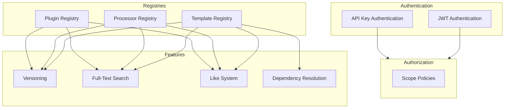
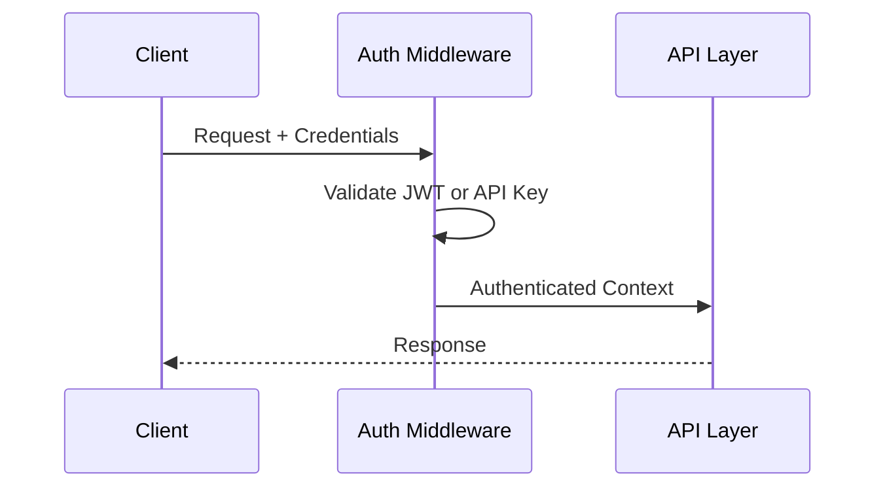
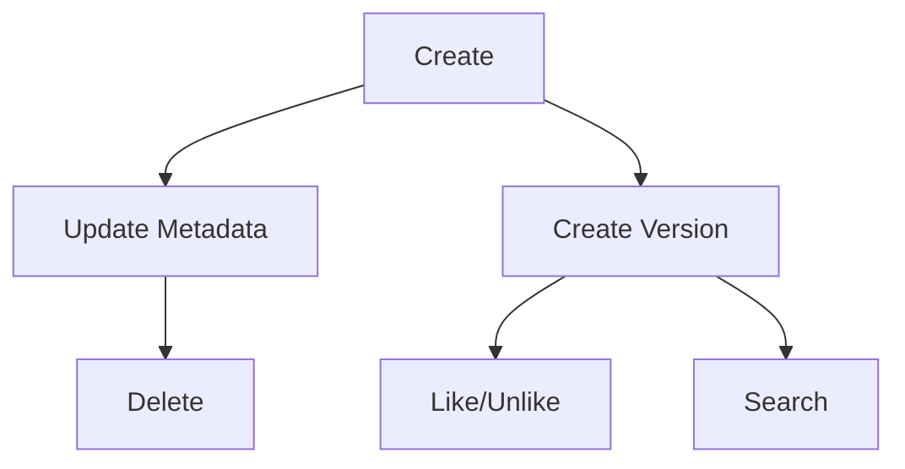
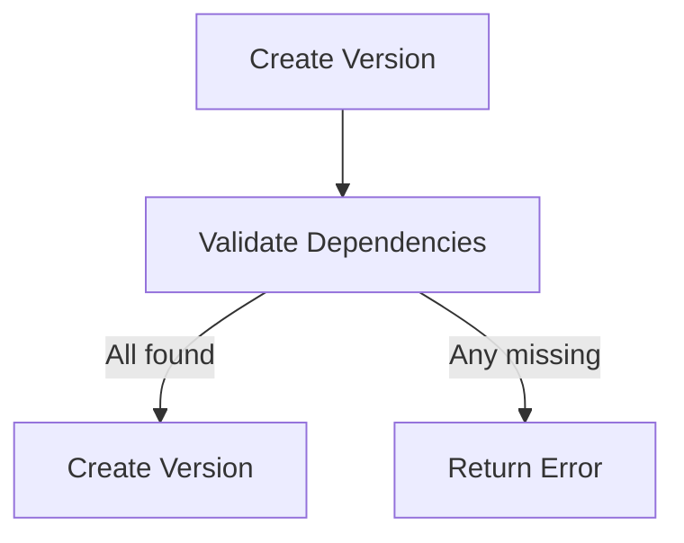
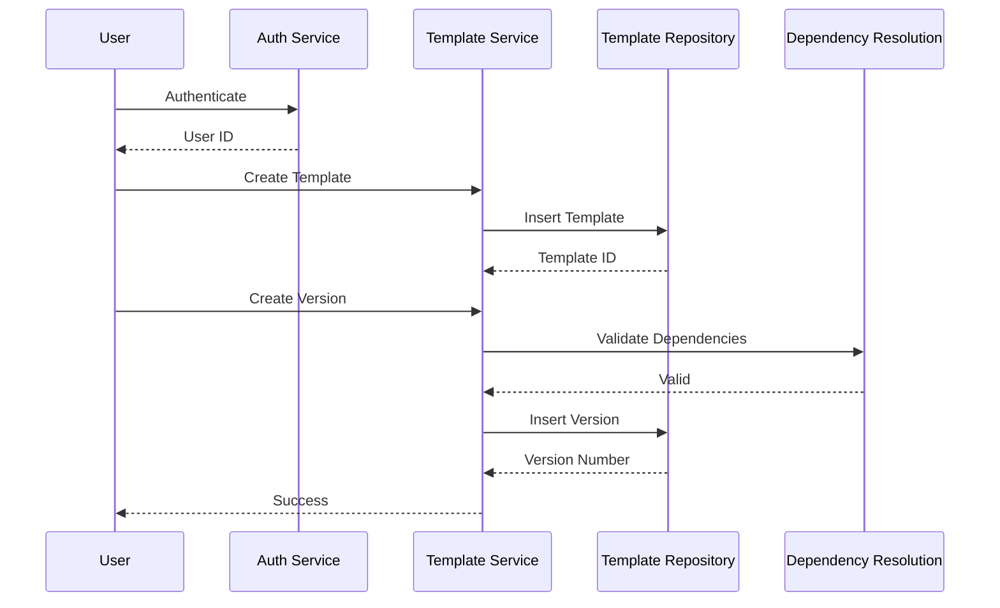
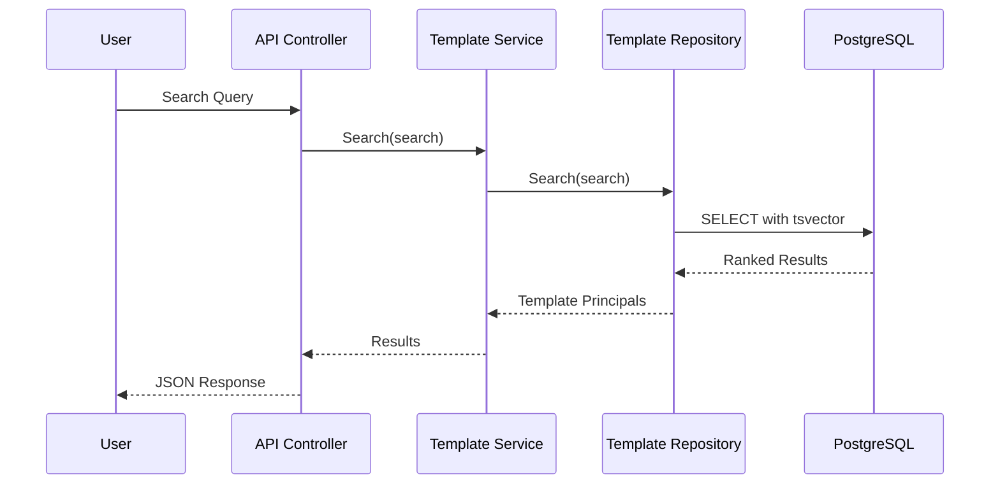

# Features Overview

This section documents the complex services and capabilities provided by Zinc.

## Features Map

## Feature Index

| Feature | What | Why | Key Files |
|---------|------|------|-----------|
| [Authentication](./01-authentication.md) | Dual JWT + API Key auth | Interactive + automation | `App/StartUp/Services/AuthService.cs` |
| [Authorization](./02-authorization.md) | Scope-based policies | Flexible access control | `App/StartUp/Services/Auth/HasAnyHandler.cs` |
| [Template Registry](./03-template-registry.md) | Template CRUD + versions | Pipeline definitions | `Domain/Service/TemplateService.cs` |
| [Processor Registry](./04-processor-registry.md) | Processor CRUD + versions | Data processors | `Domain/Service/ProcessorService.cs` |
| [Plugin Registry](./05-plugin-registry.md) | Plugin CRUD + versions | Extensible features | `Domain/Service/PluginService.cs` |
| [Full-Text Search](./06-full-text-search.md) | PostgreSQL tsvector search | Fast text queries | `App/Modules/Cyan/Data/Repositories/TemplateRepository.cs:20-64` |
| [Like System](./07-like-system.md) | User bookmarks + counts | Discovery & popularity | `App/Modules/Cyan/Data/Repositories/TemplateRepository.cs:258-339` |
| [Token Management](./08-token-management.md) | API token lifecycle | Service authentication | `Domain/Service/TokenService.cs` |

## Feature Relationships

### Authentication Flow

**See**: [Authentication](./01-authentication.md)

### Registry Operations

**See**: [Template Registry](./03-template-registry.md)

### Dependency Resolution

**See**: [Dependency Resolution Algorithm](../algorithms/01-dependency-resolution.md)

## How Features Work Together

### Template Creation Flow

### Search Flow

**See**: [Full-Text Search](./06-full-text-search.md)

## Related Sections

- [Concepts](../concepts/) - Domain terminology
- [Modules](../modules/) - Code organization
- [Algorithms](../algorithms/) - Implementation details
- [API](../surfaces/api/) - HTTP endpoints
