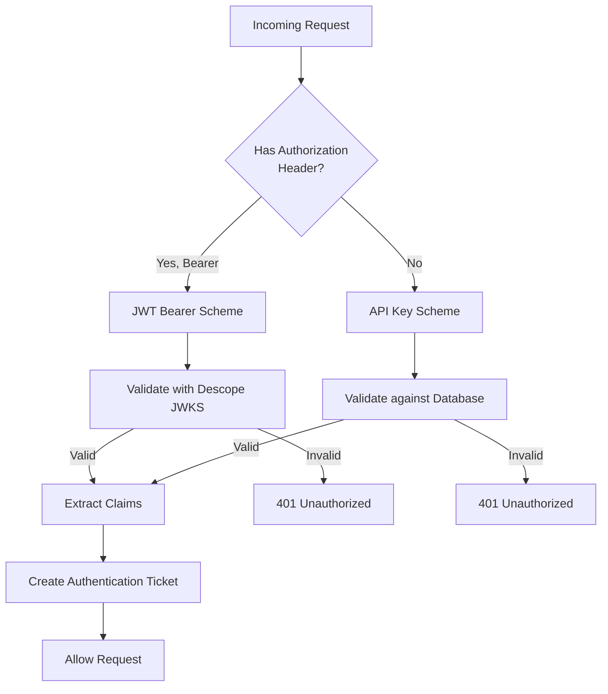
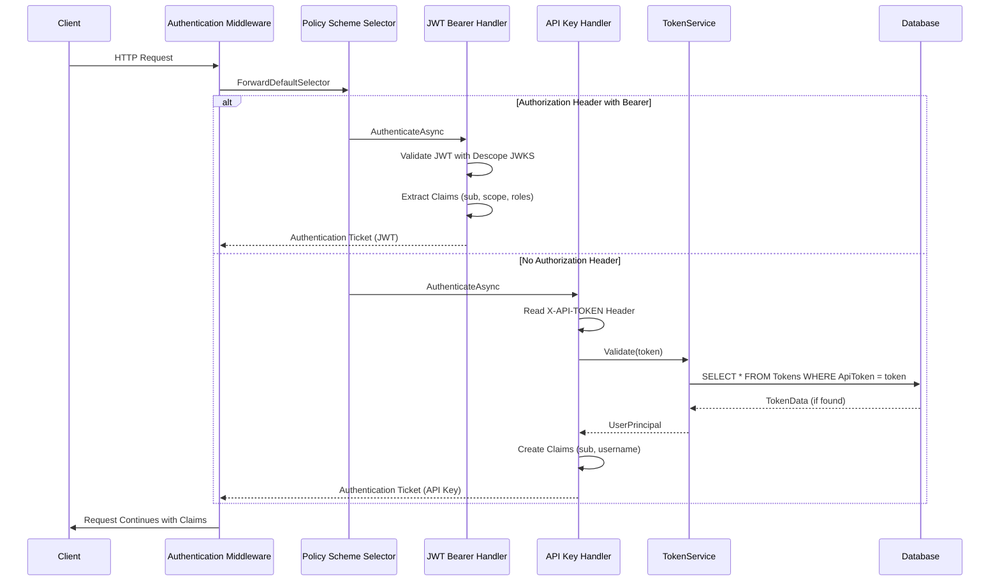
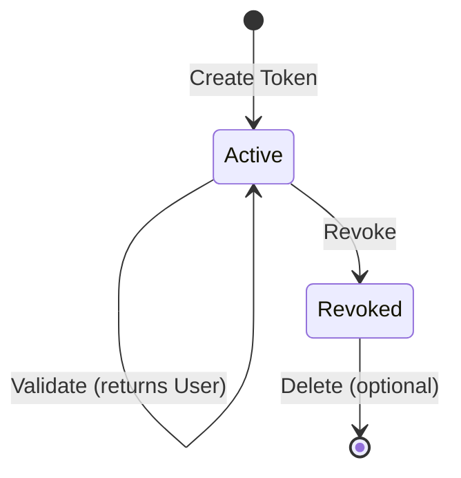

# Authentication Feature

**What**: Dual authentication scheme supporting JWT (Descope OAuth) and API Keys.
**Why**: Enables both interactive user sessions and service-to-service automation.

**Key Files**:

- `App/StartUp/Services/AuthService.cs` → `AddAuthService()`, `UseAuthService()`
- `App/Modules/Users/API/Auth/ApiKeyAuthenticationOptions.cs` → `ApiKeyAuthenticationHandler`
- `Domain/Service/ApiKeyGenerator.cs` → `Generate()`

## Overview

Zinc implements a multi-scheme authentication system that automatically selects between JWT Bearer tokens (for interactive sessions via Descope OAuth) and API Keys (for service-to-service automation like CLI tools and CI/CD pipelines).

## Authentication Schemes

### JWT Bearer Authentication

- **Provider**: Descope OAuth
- **Validation**: JWKS endpoint verification
- **Use Case**: Interactive user sessions via Web UI
- **Header**: `Authorization: Bearer <jwt-token>`

### API Key Authentication

- **Format**: 64-character random alphanumeric string
- **Storage**: Plaintext in database with revocation flag. This design intentionally favors fast token lookup and simple revocation checks over the stronger protection of hashed token storage. Be aware of the plaintext exposure risk (DB compromise). Mitigations: encryption at rest, strict DB access controls, or migrate to SHA-256 digests.
- **Validation**: Database lookup against active tokens
- **Use Case**: Service-to-service automation (CLI, CI/CD)
- **Header**: `X-API-TOKEN: <api-key>`

## Flow

### High-Level Authentication Flow



### Detailed Authentication Sequence



## Edge Cases

| Case                 | Behavior         | Key File                               |
| -------------------- | ---------------- | -------------------------------------- |
| Missing both headers | 401 Unauthorized | `ApiKeyAuthenticationOptions.cs:25-28` |
| Invalid JWT          | 401 Unauthorized | JWT validation                         |
| Invalid API Key      | 401 Unauthorized | `ApiKeyAuthenticationOptions.cs:33-39` |
| Revoked API Key      | 401 Unauthorized | `TokenService.cs:36-39`                |
| Expired JWT          | 401 Unauthorized | JWT validation                         |

## API Token Generation

**Important**: Previous documentation incorrectly described token format.

### Actual Format

- **Type**: 64-character random alphanumeric string
- **Generation**: `PasswordGenerator` library with lowercase, uppercase, numeric
- **Key File**: `Domain/Service/ApiKeyGenerator.cs:7-15`

```csharp
public string Generate()
{
    var pwd = new Password()
      .IncludeLowercase()
      .IncludeNumeric()
      .IncludeUppercase()
      .LengthRequired(64);
    return pwd.Next();
}
```

### NOT (Previous Incorrect Docs)

- ❌ `zinc_<userId>_<random>_<signature>` - This format was never implemented
- ❌ SHA256 hashing - Tokens are stored in plaintext
- ❌ Semver encoding - Versions are simple `ulong` auto-increment

## API Token Lifecycle



**Key Files**:

- Create: `Domain/Service/TokenService.cs:19-24`
- Validate: `Domain/Service/TokenService.cs:36-39`
- Revoke: `Domain/Service/TokenService.cs:31-34`

## Claims

After successful authentication, the following claims are available:

| Scheme  | Claim Type                              | Value                  | Key File                            |
| ------- | --------------------------------------- | ---------------------- | ----------------------------------- |
| JWT     | `sub`                                   | User ID                | From Descope                        |
| JWT     | `scope`                                 | Space-separated scopes | From Descope                        |
| JWT     | `http://schemas.microsoft.com/.../role` | Role claims            | From Descope                        |
| API Key | `sub`                                   | User ID                | `ApiKeyAuthenticationOptions.cs:44` |
| API Key | `username`                              | Username               | `ApiKeyAuthenticationOptions.cs:44` |

## Scheme Selection Logic

The authentication scheme is automatically selected based on request headers:

```csharp
o.ForwardDefaultSelector = context =>
{
    string authorization = context.Request.Headers[HeaderNames.Authorization]!;
    if (!string.IsNullOrEmpty(authorization) && authorization.StartsWith("Bearer "))
    {
        return JwtBearerDefaults.AuthenticationScheme;
    }
    return ApiKeyAuthenticationOptions.DefaultScheme;
};
```

**Key File**: `App/StartUp/Services/AuthService.cs:75-85`

## Related

- [Authentication Concept](../concepts/01-authentication.md) - Conceptual overview
- [Authorization Feature](./02-authorization.md) - Scope-based policies
- [Token Management Feature](./08-token-management.md) - Token CRUD operations
- [User Module](../modules/03-users.md) - User and token data models
