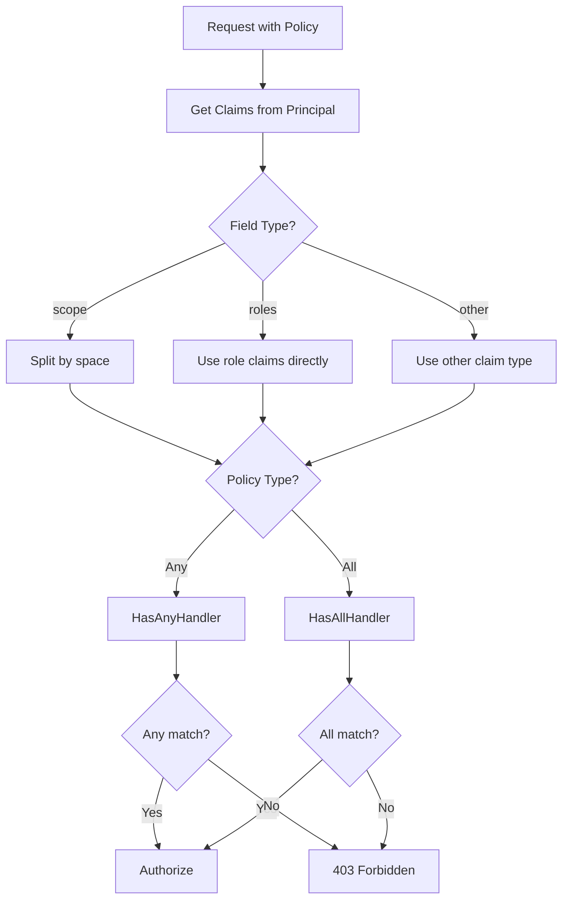
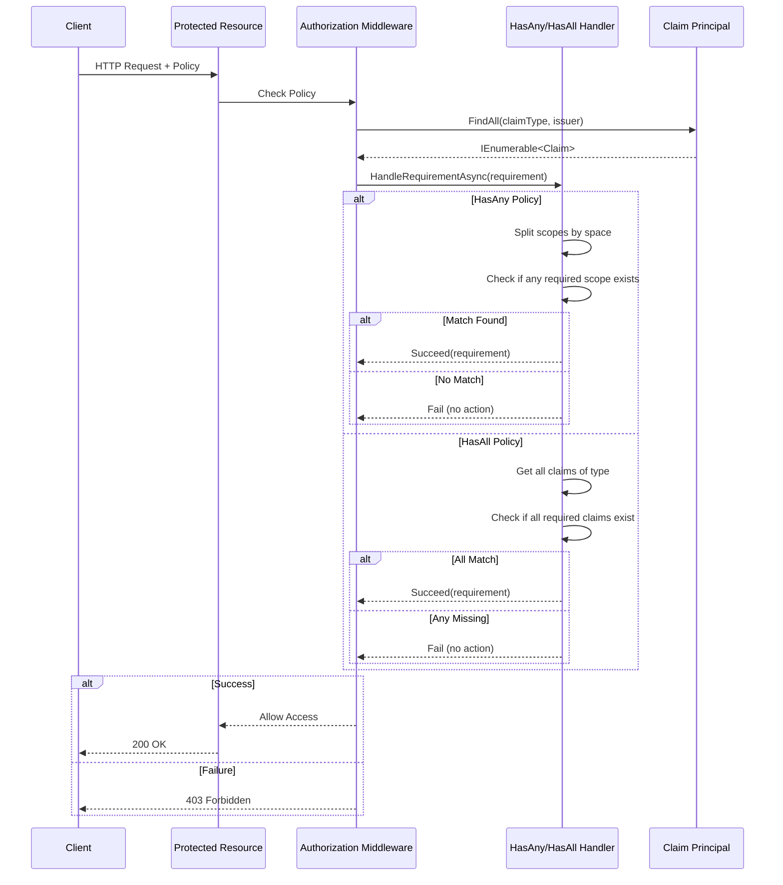
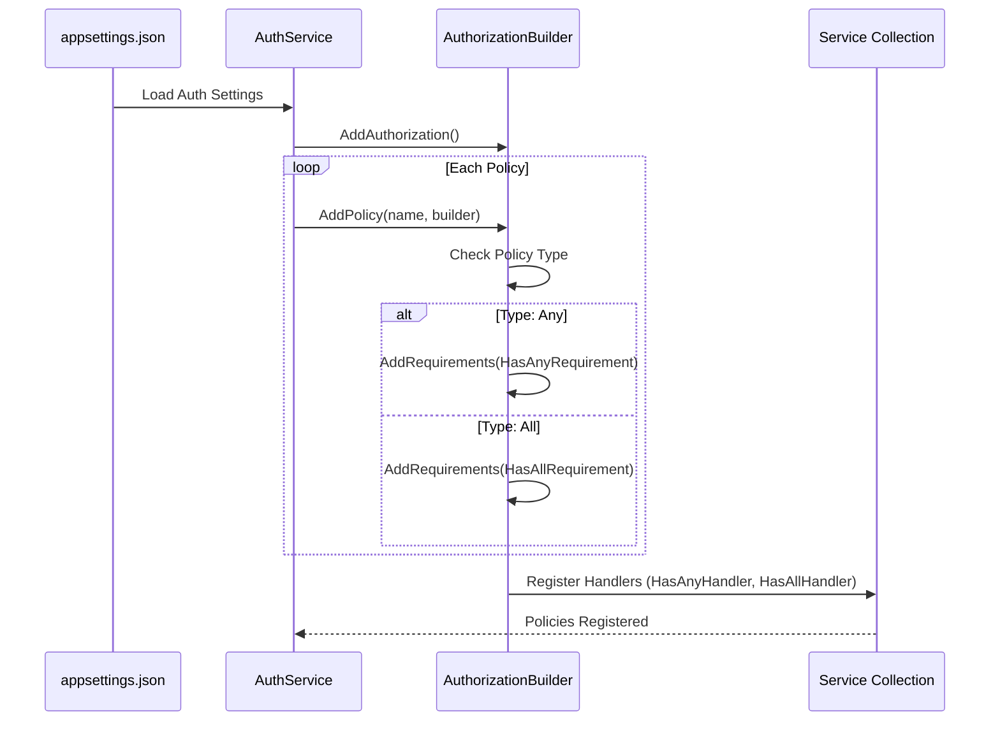

# Authorization Feature

**What**: Scope-based authorization using HasAny/HasAll policy handlers.
**Why**: Enables flexible, claims-based access control for different user roles.

**Key Files**:

- `App/StartUp/Services/Auth/HasAnyHandler.cs` → `HandleRequirementAsync()`
- `App/StartUp/Services/Auth/HasAllHandler.cs` → `HandleRequirementAsync()`
- `App/StartUp/Services/AuthService.cs` → `AddAuthService()`

## Overview

Zinc implements policy-based authorization using custom requirement handlers. Policies are configured via `appsettings.json` and support two matching strategies: **HasAny** (at least one match) and **HasAll** (all matches required).

## Authorization Policies

### HasAny Policy

User must have **at least one** of the required scopes/roles.

**Logic**: Returns success if `requirement.Scope.Any(s => scopes.Contains(s))`

**Key File**: `App/StartUp/Services/Auth/HasAnyHandler.cs:21-22`

### HasAll Policy

User must have **all** of the required scopes/roles.

**Logic**: Returns success if `requirement.Scope.All(s => scopes.Contains(s))`

**Key File**: `App/StartUp/Services/Auth/HasAllHandler.cs:28-29`

## Flow

### High-Level Authorization Flow



### Detailed Authorization Sequence



## Policy Configuration

Policies are configured in `appsettings.json`:

```json
{
  "Auth": {
    "Enabled": true,
    "Settings": {
      "Domain": "your-domain.descope.com",
      "Audience": "your-audience",
      "Issuer": "your-issuer",
      "Policies": {
        "AdminOnly": {
          "Type": "All",
          "Field": "roles",
          "Target": ["admin"]
        },
        "ReadAccess": {
          "Type": "Any",
          "Field": "scope",
          "Target": ["read:templates", "read:all"]
        },
        "WriteAccess": {
          "Type": "All",
          "Field": "scope",
          "Target": ["write:templates", "write:allowed"]
        }
      }
    }
  }
}
```

**Key File**: `App/StartUp/Services/AuthService.cs:88-112`

## Claim Field Mapping

| Field   | Source                                                         | Format                  | Processing              |
| ------- | -------------------------------------------------------------- | ----------------------- | ----------------------- |
| `scope` | JWT claim                                                      | Space-separated strings | Split before comparison |
| `roles` | `http://schemas.microsoft.com/ws/2008/06/identity/claims/role` | Individual claims       | Direct comparison       |
| Other   | Any claim type                                                 | Individual claims       | Direct comparison       |

**Key File**: `App/StartUp/Services/Auth/HasAllHandler.cs:13-22`

## Policy Registration Flow



**Key File**: `App/StartUp/Services/AuthService.cs:90-112`

## Usage in Controllers

Policies are applied using attributes:

```csharp
[Authorize(Policy = "AdminOnly")]
public async Task<ActionResult<IEnumerable<UserPrincipalResp>>> Search(
    [FromQuery] SearchUserQuery query)
{
    // Only users with 'admin' role can access
}
```

**Example**: `App/Modules/Users/API/V1/UserController.cs:33`

## Edge Cases

| Case                | Behavior                  | Key File                                        |
| ------------------- | ------------------------- | ----------------------------------------------- |
| No matching claims  | Authorization fails (403) | Handler does not call `Succeed()`               |
| Empty scope array   | Authorization fails       | `scopes.Contains()` returns false               |
| Wrong issuer        | Claims not found          | Handler checks `c.Issuer == requirement.Issuer` |
| Missing policy name | Throws at startup         | `AddPolicy()` fails                             |

## Authorization vs Authentication

| Aspect            | Authentication        | Authorization        |
| ----------------- | --------------------- | -------------------- |
| **Question**      | Who are you?          | What can you do?     |
| **Mechanism**     | JWT or API Key        | Policy handlers      |
| **Claims Source** | Descope or Database   | Policy configuration |
| **Failure**       | 401 Unauthorized      | 403 Forbidden        |
| **Middleware**    | `UseAuthentication()` | `UseAuthorization()` |

**Key File**: `App/StartUp/Services/AuthService.cs:14-19`

## Related

- [Authorization Concept](../concepts/02-authorization.md) - Conceptual overview
- [Authentication Feature](./01-authentication.md) - How users are authenticated
- [API Authorization](../surfaces/api/) - Endpoint-specific policies
