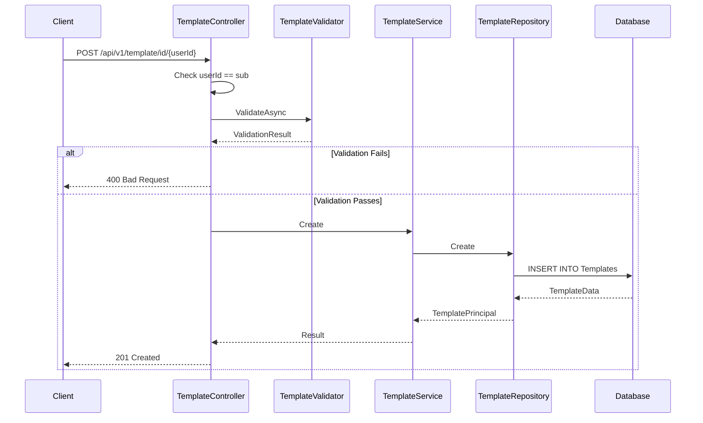
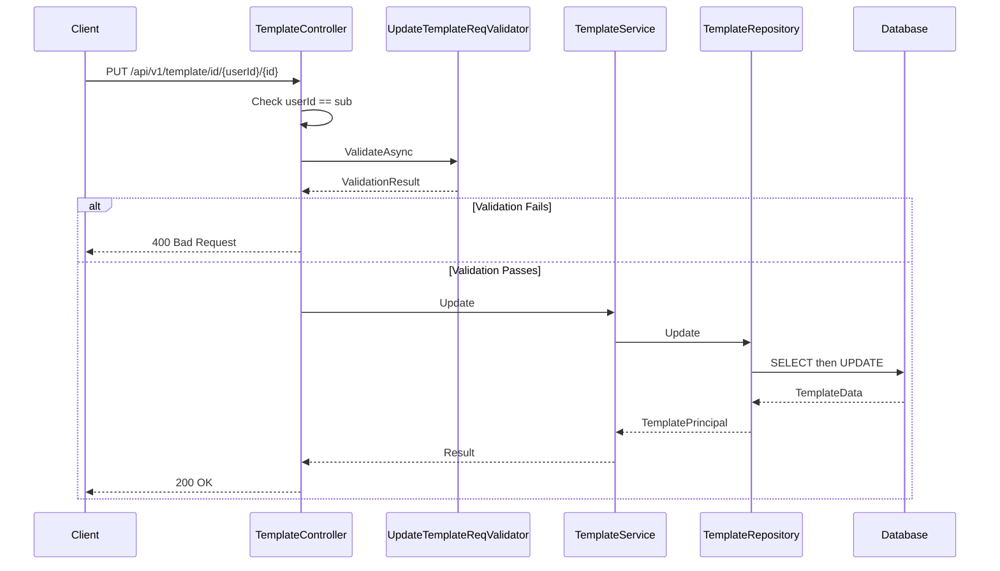

# Template Registry Feature

**What**: CRUD operations for templates with versioning and dependency management.
**Why**: Stores CI/CD pipeline definitions with immutable versions.

**Key Files**:

- `Domain/Service/TemplateService.cs` → `Create()`, `Update()`, `Delete()`
- `App/Modules/Cyan/Data/Repositories/TemplateRepository.cs` → `Create()`, `Update()`, `Delete()`
- `App/Modules/Cyan/API/V1/Controllers/TemplateController.cs` → Endpoints

## Overview

The Template Registry manages CI/CD pipeline definitions. Templates contain metadata (editable) and versions (immutable). Each version can reference specific versions of processors, plugins, and other templates.

For the conceptual overview of registry structure, see [Registry Concept](../concepts/03-registry.md). For version management, see [Version Concept](../concepts/04-version.md).

## Operations

| Operation   | Endpoint                                      | Key File                        |
| ----------- | --------------------------------------------- | ------------------------------- |
| Search      | `GET /api/v1/template`                        | `TemplateController.cs:38-49`   |
| Get by ID   | `GET /api/v1/template/id/{userId}/{id}`       | `TemplateController.cs:51-59`   |
| Get by slug | `GET /api/v1/template/slug/{username}/{name}` | `TemplateController.cs:61-69`   |
| Create      | `POST /api/v1/template/id/{userId}`           | `TemplateController.cs:71-91`   |
| Update      | `PUT /api/v1/template/id/{userId}/{id}`       | `TemplateController.cs:93-117`  |
| Delete      | `DELETE /api/v1/template/id/{userId}/{id}`    | `TemplateController.cs:149-157` |

## Flow

### Create Template Sequence

### Update Template Sequence

## Version Operations

Templates support versioning. For details on version management, see [Version Concept](../concepts/04-version.md).

| Operation      | Endpoint                                                  | Key File                     |
| -------------- | --------------------------------------------------------- | ---------------------------- |
| Get version    | `GET /api/v1/template/id/{userId}/{id}/version/{version}` | `TemplateController.cs`      |
| Get latest     | `GET /api/v1/template/id/{userId}/{id}/version/latest`    | `TemplateController.cs`      |
| Create version | `POST /api/v1/template/id/{userId}/{id}/version`          | `TemplateService.cs:160-196` |

## Edge Cases

| Case                         | Behavior         | Key File                        |
| ---------------------------- | ---------------- | ------------------------------- |
| Duplicate name (same user)   | 409 Conflict     | `TemplateRepository.cs:150-163` |
| Update non-existent template | null result      | `TemplateRepository.cs:185-186` |
| Delete non-existent template | null result      | `TemplateRepository.cs:244-245` |
| User mismatch                | 401 Unauthorized | `TemplateController.cs:78-84`   |

## Search Functionality

Templates support full-text search. See [Full-Text Search Feature](./06-full-text-search.md) for details.

## Template Identifiers

Templates can be identified two ways:

1. **By GUID**: `/api/v1/template/id/{userId}/{templateId}`
2. **By Slug**: `/api/v1/template/slug/{username}/{name}`

## Related

- [Registry Concept](../concepts/03-registry.md) - Registry entity structure
- [Version Concept](../concepts/04-version.md) - Version management
- [Dependency Concept](../concepts/05-dependency.md) - Cross-version references
- [Cyan Module](../modules/01-cyan.md) - Code organization
- [Template API](../surfaces/api/01-template.md) - API endpoints
