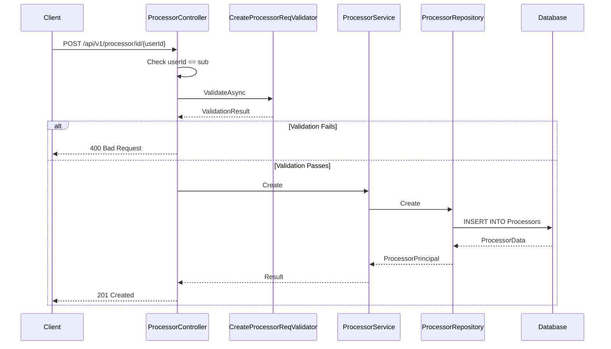

# Processor Registry Feature

**What**: CRUD operations for processors with versioning.
**Why**: Stores data processing component definitions.

**Key Files**:

- `Domain/Service/ProcessorService.cs` → `Create()`, `Update()`, `Delete()`
- `App/Modules/Cyan/Data/Repositories/ProcessorRepository.cs` → Data access
- `App/Modules/Cyan/API/V1/Controllers/ProcessorController.cs` → Endpoints

## Overview

The Processor Registry manages data processing components. Like templates, processors contain metadata and versions. Processors can be referenced by template versions as dependencies.

For the conceptual overview of registry structure, see [Registry Concept](../concepts/03-registry.md). For version management, see [Version Concept](../concepts/04-version.md).

## Operations

| Operation   | Endpoint                                       | Key File                         |
| ----------- | ---------------------------------------------- | -------------------------------- |
| Search      | `GET /api/v1/processor`                        | `ProcessorController.cs:38-49`   |
| Get by ID   | `GET /api/v1/processor/id/{userId}/{id}`       | `ProcessorController.cs:51-69`   |
| Get by slug | `GET /api/v1/processor/slug/{username}/{name}` | `ProcessorController.cs:71-89`   |
| Create      | `POST /api/v1/processor/id/{userId}`           | `ProcessorController.cs:91-120`  |
| Update      | `PUT /api/v1/processor/id/{userId}/{id}`       | `ProcessorController.cs:122-145` |
| Delete      | `DELETE /api/v1/processor/id/{userId}/{id}`    | `ProcessorController.cs:147-155` |

## Flow

### Create Processor Sequence



## Version Operations

Processors support versioning. For details on version management, see [Version Concept](../concepts/04-version.md).

## Processor Model

```csharp
public record ProcessorData
{
    public Guid Id { get; set; }
    public uint Downloads { get; set; }
    public string Name { get; set; } = string.Empty;
    public string Project { get; set; } = string.Empty;
    public string Source { get; set; } = string.Empty;
    public string Email { get; set; } = string.Empty;
    public string[] Tags { get; set; } = Array.Empty<string>();
    public string Description { get; set; } = string.Empty;
    public string Readme { get; set; } = string.Empty;
    public NpgsqlTsVector SearchVector { get; set; } = null!;
    public string UserId { get; set; } = string.Empty;
    public UserData User { get; set; } = null!;
    public IEnumerable<ProcessorVersionData> Versions { get; set; } = null!;
    public IEnumerable<ProcessorLikeData> Likes { get; set; } = null!;
}
```

**Key File**: `App/Modules/Cyan/Data/Models/ProcessorData.cs`

## Edge Cases

| Case                          | Behavior         |
| ----------------------------- | ---------------- |
| Duplicate name (same user)    | 409 Conflict     |
| Update non-existent processor | null result      |
| Delete non-existent processor | null result      |
| User mismatch                 | 401 Unauthorized |

## Dependency References

Processors are referenced by template versions. When a template version is created, it validates that all referenced processor versions exist.

**Key File**: `Domain/Service/TemplateService.cs:170-172`

## Search Functionality

Processors support full-text search similar to templates.

**Key File**: `App/Modules/Cyan/Data/Repositories/ProcessorRepository.cs`

## Like System

Processors support user likes:

| Operation | Endpoint                                                     | Purpose            |
| --------- | ------------------------------------------------------------ | ------------------ |
| Like      | `POST /api/v1/processor/{username}/{name}/like`              | Like a processor   |
| Unlike    | `POST /api/v1/processor/{username}/{name}/like` (like=false) | Unlike a processor |

## Related

- [Registry Concept](../concepts/03-registry.md) - Registry entity structure
- [Version Concept](../concepts/04-version.md) - Version management
- [Dependency Concept](../concepts/05-dependency.md) - How templates reference processors
- [Like System Feature](./07-like-system.md) - Like/unlike functionality
- [Cyan Module](../modules/01-cyan.md) - Code organization
- [Processor API](../surfaces/api/02-processor.md) - API endpoints
