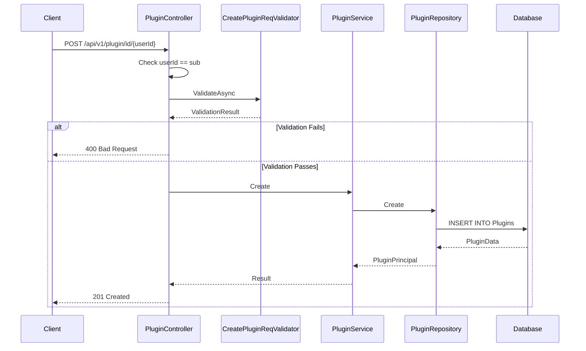

# Plugin Registry Feature

**What**: CRUD operations for plugins with versioning.
**Why**: Stores extensible functionality components.

**Key Files**:

- `Domain/Service/PluginService.cs` → `Create()`, `Update()`, `Delete()`
- `App/Modules/Cyan/Data/Repositories/PluginRepository.cs` → Data access
- `App/Modules/Cyan/API/V1/Controllers/PluginController.cs` → Endpoints

## Overview

The Plugin Registry manages extensible functionality components. Like templates and processors, plugins contain metadata and versions. Plugins can be referenced by template versions as dependencies.

For the conceptual overview of registry structure, see [Registry Concept](../concepts/03-registry.md). For version management, see [Version Concept](../concepts/04-version.md).

## Operations

| Operation   | Endpoint                                      | Key File                      |
| ----------- | --------------------------------------------- | ----------------------------- |
| Search      | `GET /api/v1/plugin`                          | `PluginController.cs:38-49`   |
| Get by ID   | `GET /api/v1/plugin/id/{userId}/{id}`         | `PluginController.cs:51-69`   |
| Get by slug | `GET /api/v1/plugin/slug/{username}/{name}`   | `PluginController.cs:71-89`   |
| Create      | `POST /api/v1/plugin/id/{userId}`             | `PluginController.cs:91-120`  |
| Update      | `PUT /api/v1/plugin/id/{userId}/{id}`         | `PluginController.cs:122-145` |
| Delete      | `DELETE /api/v1/plugin/id/{userId}/{id:guid}` | `PluginController.cs:140-148` |

## Flow

### Create Plugin Sequence



## Version Operations

Plugins support versioning. For details on version management, see [Version Concept](../concepts/04-version.md).

## Plugin Model

```csharp
public record PluginData
{
    public Guid Id { get; set; }
    public uint Downloads { get; set; }
    public string Name { get; set; } = string.Empty;
    public string Project { get; set; } = string.Empty;
    public string Source { get; set; } = string.Empty;
    public string Email { get; set; } = string.Empty;
    public string[] Tags { get; set; } = Array.Empty<string>();
    public string Description { get; set; } = string.Empty;
    public string Readme { get; set; } = string.Empty;
    public NpgsqlTsVector SearchVector { get; set; } = null!;
    public string UserId { get; set; } = string.Empty;
    public UserData User { get; set; } = null!;
    public IEnumerable<PluginVersionData> Versions { get; set; } = null!;
    public IEnumerable<PluginLikeData> Likes { get; set; } = null!;
}
```

**Key File**: `App/Modules/Cyan/Data/Models/PluginData.cs`

## Edge Cases

<!--
NOTE: The 401 Unauthorized response for user mismatch matches the current controller implementation.
While HTTP semantics might suggest 403 Forbidden for an authenticated-but-unauthorized user,
the docs accurately reflect the current code behavior. Changing this would require code modifications.
-->

| Case                       | Behavior         |
| -------------------------- | ---------------- |
| Duplicate name (same user) | 409 Conflict     |
| Update non-existent plugin | 404 Not Found    |
| Delete non-existent plugin | 404 Not Found    |
| User mismatch              | 401 Unauthorized |

## Dependency References

Plugins are referenced by template versions. When a template version is created, it validates that all referenced plugin versions exist.

**Key File**: `Domain/Service/TemplateService.cs:170-172`

## Search Functionality

Plugins support full-text search similar to templates.

**Key File**: `App/Modules/Cyan/Data/Repositories/PluginRepository.cs`

## Like System

<!--
NOTE: The plugin like endpoint documented here uses the slug path with likerId and true/false path segment.
This matches the controller implementation. The Like System feature doc shows a simplified pattern for illustration.
-->

Plugins support user likes:

| Operation | Endpoint                                                          | Purpose         |
| --------- | ----------------------------------------------------------------- | --------------- |
| Like      | `POST /api/v1/plugin/slug/{username}/{name}/like/{likerId}/true`  | Like a plugin   |
| Unlike    | `POST /api/v1/plugin/slug/{username}/{name}/like/{likerId}/false` | Unlike a plugin |

## Related

- [Registry Concept](../concepts/03-registry.md) - Registry entity structure
- [Version Concept](../concepts/04-version.md) - Version management
- [Dependency Concept](../concepts/05-dependency.md) - How templates reference plugins
- [Like System Feature](./07-like-system.md) - Like/unlike functionality
- [Cyan Module](../modules/02-cyan.md) - Code organization
- [Plugin API](../surfaces/api/03-plugin.md) - API endpoints
