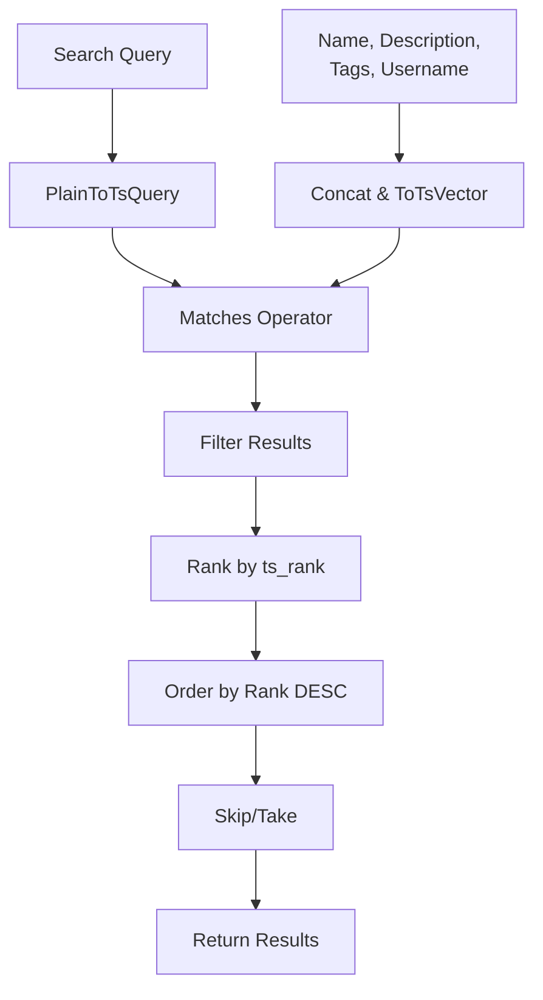
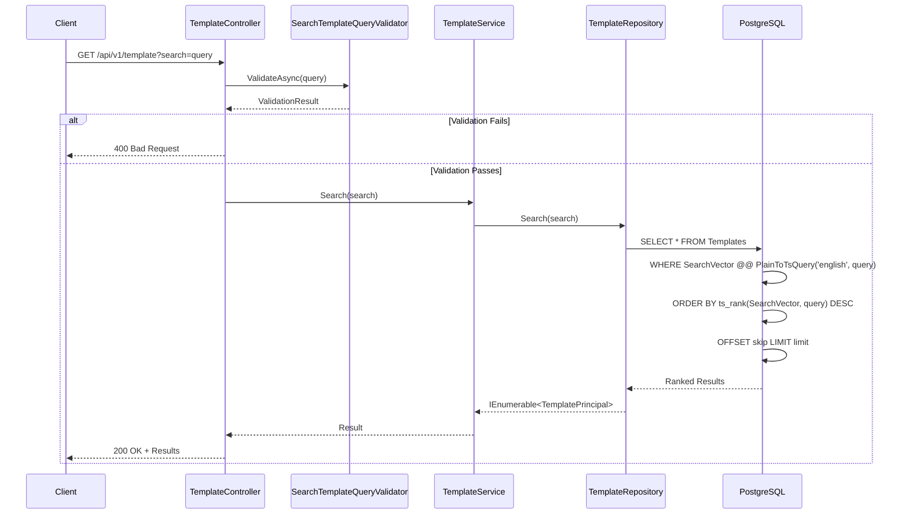

# Full-Text Search Feature

**What**: PostgreSQL full-text search using `tsvector` and GIN indexes.
**Why**: Fast, ranked text search across templates, processors, and plugins.

**Key Files**:

- `App/Modules/Cyan/Data/Repositories/TemplateRepository.cs` → `Search()`
- `App/StartUp/Database/MainDbContext.cs` → `SearchVector` columns

## Overview

Zinc uses PostgreSQL's native full-text search capabilities to provide fast text search with ranking. Search vectors are automatically generated and indexed using GIN indexes for optimal query performance.

## Search Implementation

### TsVector Columns

Each registry entity has a `SearchVector` column:

```csharp
public record TemplateData
{
    // ... other fields
    public NpgsqlTsVector SearchVector { get; set; } = null!;
}
```

**Key File**: `App/Modules/Cyan/Data/Models/TemplateData.cs:26`

### Database Configuration

```csharp
modelBuilder.Entity<TemplateData>(entity =>
{
    entity.HasIndex(x => x.SearchVector)
        .HasMethod("GIN")
        .IsTsVector();
});
```

**Key File**: `App/StartUp/Database/MainDbContext.cs:86-92`

## Flow

### High-Level Search Flow



### Detailed Search Sequence



**Key File**: `App/Modules/Cyan/Data/Repositories/TemplateRepository.cs:20-64`

## Search Query Construction

```csharp
var templates = db.Templates.AsQueryable();

if (search.Search != null)
{
    templates = templates
        .Include(x => x.User)
        .Where(x =>
            // Full text search
            x.SearchVector
                .Concat(EF.Functions.ToTsVector("english", x.User.Username))
                .Concat(EF.Functions.ArrayToTsVector(x.Tags))
                .Matches(EF.Functions.PlainToTsQuery("english", search.Search.Replace("/", " ")))
            || EF.Functions.ILike(x.Name, $"%{search.Search}%")
            || EF.Functions.ILike(x.User.Username, $"%{search.Search}%")
        )
        // Rank with full text search
        .OrderByDescending(x =>
            x.SearchVector
                .Concat(EF.Functions.ToTsVector("english", x.User.Username))
                .Concat(EF.Functions.ArrayToTsVector(x.Tags))
                .Rank(EF.Functions.PlainToTsQuery("english", search.Search.Replace("/", " ")))
        );
}
```

**Key File**: `App/Modules/Cyan/Data/Repositories/TemplateRepository.cs:34-49`

## Search Fields

| Field       | Source               | Processing                           |
| ----------- | -------------------- | ------------------------------------ |
| Name        | Template name        | `ToTsVector("english", Name)`        |
| Description | Template description | `ToTsVector("english", Description)` |
| Tags        | Tag array            | `ArrayToTsVector(Tags)`              |
| Username    | Owner username       | `ToTsVector("english", Username)`    |

## Search Operators

| Operator    | Purpose                            | Example                              |
| ----------- | ---------------------------------- | ------------------------------------ |
| `@@`        | Matches (tsvector matches tsquery) | `SearchVector @@ ToTsQuery('query')` |
| `\|\|`      | Concatenate (combine vectors)      | `V1 \|\| V2`                         |
| `ts_rank()` | Calculate relevance score          | `ts_rank(vector, query)`             |

## Indexing

GIN indexes provide fast full-text search:

```sql
CREATE INDEX templates_search_vector_idx
ON templates
USING GIN (search_vector);
```

**Key File**: `App/StartUp/Database/MainDbContext.cs:86-92`

## Edge Cases

| Case               | Behavior                         |
| ------------------ | -------------------------------- |
| Empty search query | Returns all results (paginated)  |
| No matches         | Returns empty array              |
| Special characters | Replaced with spaces (`/` → ` `) |
| Multiple words     | AND logic (all words must match) |

## Search Configuration

- **Language**: English
- **Search Type**: Plain text search (not phrase search)
- **Ranking**: `ts_rank()` by default
- **Fallback**: ILIKE pattern matching for name/username

## Performance Considerations

1. **GIN Indexes**: Fast lookups but slower inserts
2. **Concatenation**: Combines multiple vectors at query time
3. **Ranking**: Adds computational overhead
4. **Pagination**: Skip/Take limits result set size

## Related

- [Template Registry Feature](./03-template-registry.md#search-functionality) - Template search
- [Processor Registry Feature](./04-processor-registry.md) - Processor search
- [Plugin Registry Feature](./05-plugin-registry.md) - Plugin search
- [Version Resolution Algorithm](../algorithms/02-version-resolution.md) - Query patterns
