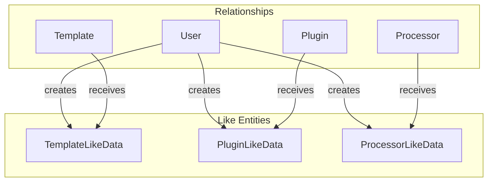
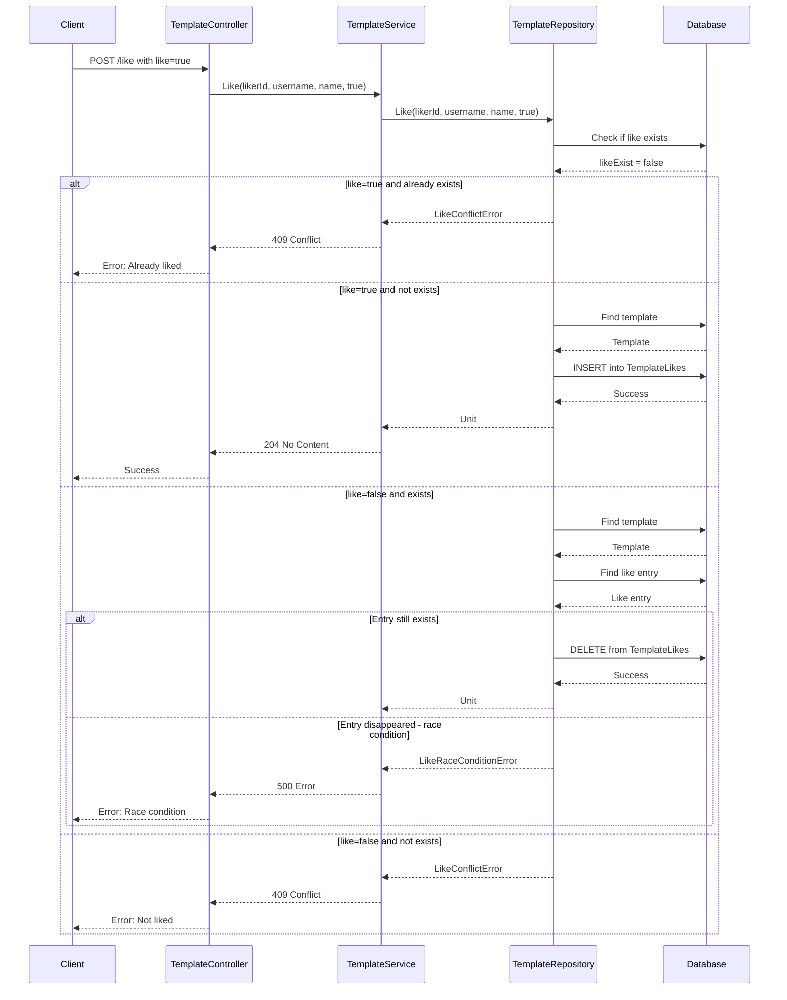

# Like System Feature

**What**: User-to-entity association for bookmarking/favoriting with optimistic locking.
**Why**: Allows users to track and discover popular templates, processors, and plugins.

**Key Files**:

- `App/Modules/Cyan/Data/Repositories/TemplateRepository.cs` → `Like()`
- `App/Modules/Cyan/Data/Models/LikeData.cs` → Like entity models
- `App/Error/V1/LikeConflict.cs` → Conflict error
- `App/Error/V1/LikeRaceCondition.cs` → Race condition error

## Overview

The Like System allows users to bookmark their favorite templates, processors, and plugins. It uses optimistic locking to handle concurrent like/unlike operations and provides detailed error messages for edge cases.

## Like Entities

Each registry type has its own Like entity:



**Key File**: `App/Modules/Cyan/Data/Models/LikeData.cs`

## Flow

### Like Sequence



**Key File**: `App/Modules/Cyan/Data/Repositories/TemplateRepository.cs:258-339`

## Optimistic Locking

The Like System uses optimistic locking to detect race conditions during unlike operations. If the like entry disappears between the check and delete (e.g., another concurrent request removed it), a `LikeRaceConditionError` is returned.

**Key File**: `App/Modules/Cyan/Data/Repositories/TemplateRepository.cs:304-318`

## Edge Cases

| Case                     | Behavior     | Error                    | Key File                        |
| ------------------------ | ------------ | ------------------------ | ------------------------------- |
| Like already liked       | 409 Conflict | `LikeConflictError`      | `TemplateRepository.cs:270-276` |
| Unlike not liked         | 409 Conflict | `LikeConflictError`      | `TemplateRepository.cs:270-276` |
| Race condition on unlike | 500 Error    | `LikeRaceConditionError` | `TemplateRepository.cs:313-318` |

## Error Types

### LikeConflictError

```csharp
public class LikeConflictError : UserError
{
    public LikeConflictError(string title, string target, string type, string action)
        : base(
            $"Failed to {action} {type}",
            $"The {type} '{target}' is already {action}ed"
        )
    { }
}
```

**Key File**: `App/Error/V1/LikeConflict.cs`

### LikeRaceConditionError

<!--
NOTE: LikeRaceConditionError extends UserError but maps to HTTP 500 Internal Server Error.
This is intentional: while UserError typically maps to 4xx client errors, a race condition
indicates a transient server-side conflict (concurrent modification) rather than a client
mistake. The 500 status signals the client should retry the operation, not fix their request.
-->

```csharp
public class LikeRaceConditionError : UserError
{
    public LikeRaceConditionError(string title, string target, string type, string action)
        : base(
            $"Failed to {action} {type}",
            $"Race condition detected: {type} '{target}' state changed during operation"
        )
    { }
}
```

**Key File**: `App/Error/V1/LikeRaceCondition.cs`

## Uniqueness Constraint

Each user can like an entity only once:

```sql
UNIQUE ("UserId", "TemplateId")
UNIQUE ("UserId", "PluginId")
UNIQUE ("UserId", "ProcessorId")
```

## Like Count

Likes are counted and included in entity info:

```csharp
public class TemplateInfo
{
    public uint Downloads { get; set; }
    public uint Stars { get; set; }  // Like count
}
```

**Key File**: `App/Modules/Cyan/Data/Repositories/TemplateRepository.cs:81-85`

## API Endpoints

| Endpoint                                   | Method | Purpose                 |
| ------------------------------------------ | ------ | ----------------------- |
| `/api/v1/template/{username}/{name}/like`  | POST   | Like/unlike a template  |
| `/api/v1/plugin/{username}/{name}/like`    | POST   | Like/unlike a plugin    |
| `/api/v1/processor/{username}/{name}/like` | POST   | Like/unlike a processor |

**Request Body**:

```json
{
  "like": true
}
```

## Related

- [Registry Feature](./03-template-registry.md) - Template operations
- [User Module](../modules/03-users.md) - User data model
