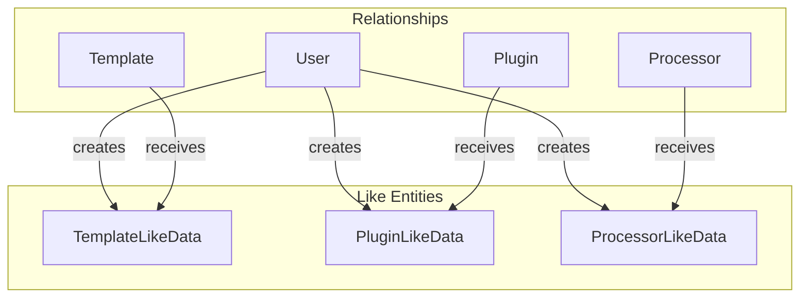
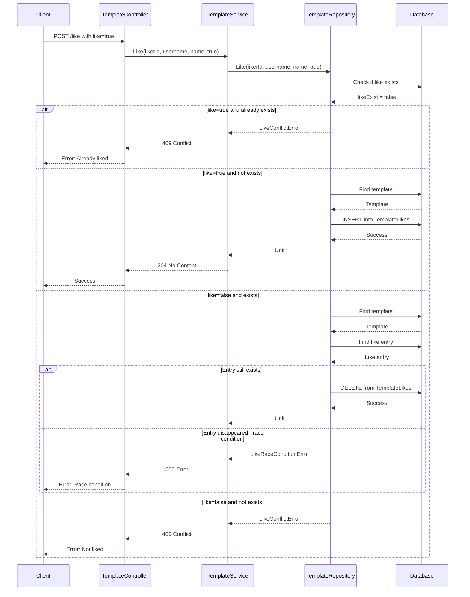

# Like System Feature

**What**: User-to-entity association for bookmarking/favoriting with optimistic locking.
**Why**: Allows users to track and discover popular templates, processors, and plugins.

**Key Files**:

- `App/Modules/Cyan/Data/Repositories/TemplateRepository.cs` → `Like()`
- `App/Modules/Cyan/Data/Models/LikeData.cs` → Like entity models
- `App/Error/V1/LikeConflict.cs` → Conflict error
- `App/Error/V1/LikeRaceCondition.cs` → Race condition error

## Overview

The Like System allows users to bookmark their favorite templates, processors, and plugins. It uses optimistic locking to handle concurrent like/unlike operations and provides detailed error messages for edge cases.

## Like Entities

Each registry type has its own Like entity:



**Key File**: `App/Modules/Cyan/Data/Models/LikeData.cs`

## Flow

### Like Sequence



**Key File**: `App/Modules/Cyan/Data/Repositories/TemplateRepository.cs:258-339`

## Optimistic Locking

The Like System uses optimistic locking to detect race conditions during unlike operations. If the like entry disappears between the check and delete (e.g., another concurrent request removed it), a `LikeRaceConditionError` is returned.

**Key File**: `App/Modules/Cyan/Data/Repositories/TemplateRepository.cs:304-318`

## Edge Cases

| Case                     | Behavior     | Error                    | Key File                        |
| ------------------------ | ------------ | ------------------------ | ------------------------------- |
| Like already liked       | 409 Conflict | `LikeConflictError`      | `TemplateRepository.cs:270-276` |
| Unlike not liked         | 409 Conflict | `LikeConflictError`      | `TemplateRepository.cs:270-276` |
| Race condition on unlike | 500 Error    | `LikeRaceConditionError` | `TemplateRepository.cs:313-318` |

## Error Types

### LikeConflictError

```csharp
internal class LikeConflictError : IDomainProblem
{
  public LikeConflictError(
    string detail,
    string resourceId,
    string resourceType,
    string conflictType
  )
  {
    this.Detail = detail;
    this.ResourceId = resourceId;
    this.ResourceType = resourceType;
    this.ConflictType = conflictType;
  }

  public string Id { get; } = "like_conflict";
  public string Title { get; } = "Like Conflict";
  public string Version { get; } = "v1";
  public string Detail { get; } = string.Empty;
  public string ResourceType { get; } = string.Empty;
  public string ResourceId { get; } = string.Empty;
  public string ConflictType { get; } = string.Empty;
}
```

**Key File**: `App/Error/V1/LikeConflict.cs`

### LikeRaceConditionError

<!--
NOTE: LikeRaceConditionError maps to HTTP 409 Conflict (not 500).
Race conditions in the like system are handled gracefully and return a conflict status,
signaling the client that the operation should be retried.
-->

```csharp
internal class LikeRaceConditionError : IDomainProblem
{
  public LikeRaceConditionError(
    string detail,
    string resourceId,
    string resourceType,
    string conflictType
  )
  {
    this.Detail = detail;
    this.ResourceId = resourceId;
    this.ResourceType = resourceType;
    this.ConflictType = conflictType;
  }

  public string Id { get; } = "like_race_condition";
  public string Title { get; } = "Like Race Condition";
  public string Version { get; } = "v1";
  public string Detail { get; } = string.Empty;
  public string ResourceType { get; } = string.Empty;
  public string ResourceId { get; } = string.Empty;
  public string ConflictType { get; } = string.Empty;
}
```

**Key File**: `App/Error/V1/LikeRaceCondition.cs`

## Uniqueness Constraint

Each user can like an entity only once:

```sql
UNIQUE ("UserId", "TemplateId")
UNIQUE ("UserId", "PluginId")
UNIQUE ("UserId", "ProcessorId")
```

## Like Count

Likes are counted and included in entity info:

```csharp
public class TemplateInfo
{
    public uint Downloads { get; set; }
    public uint Stars { get; set; }  // Like count
}
```

**Key File**: `App/Modules/Cyan/Data/Repositories/TemplateRepository.cs:81-85`

## API Endpoints

| Endpoint                                                         | Method | Purpose                 |
| ---------------------------------------------------------------- | ------ | ----------------------- |
| `/api/v1/template/slug/{username}/{name}/like/{likerId}/{like}`  | POST   | Like/unlike a template  |
| `/api/v1/plugin/slug/{username}/{name}/like/{likerId}/{like}`    | POST   | Like/unlike a plugin    |
| `/api/v1/processor/slug/{username}/{name}/like/{likerId}/{like}` | POST   | Like/unlike a processor |

**Path Parameters**:

- `{likerId}`: ID of the user performing the like/unlike action
- `{like}`: `true` to like, `false` to unlike

## Related

- [Registry Feature](./03-template-registry.md) - Template operations
- [User Module](../modules/03-users.md) - User data model
