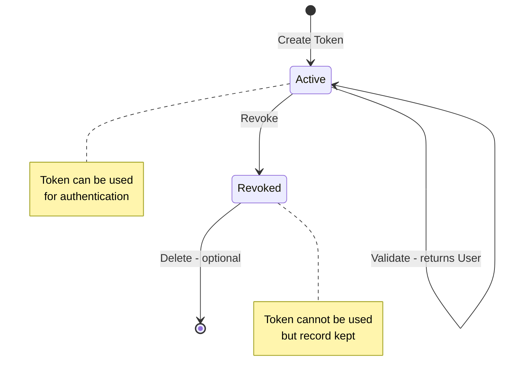
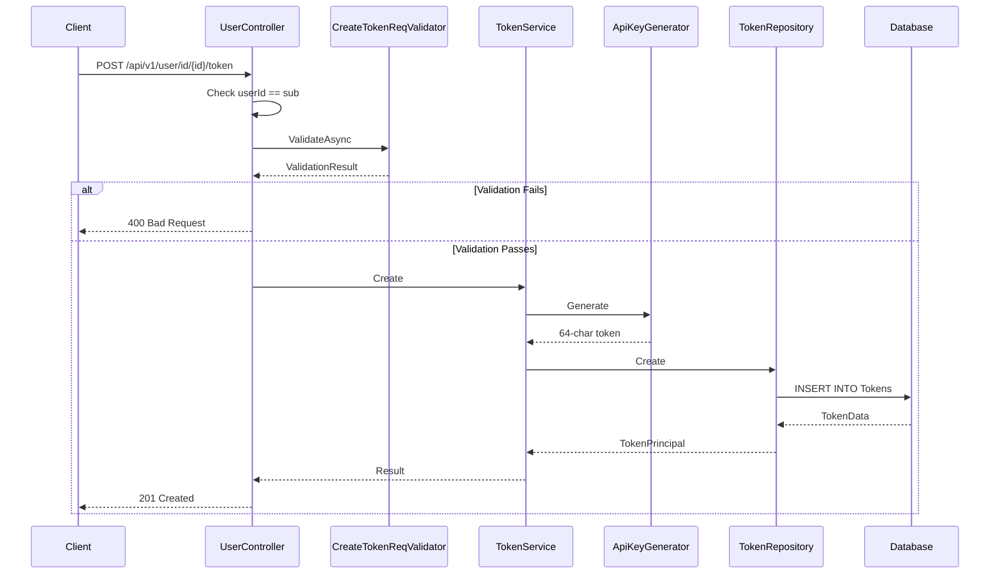
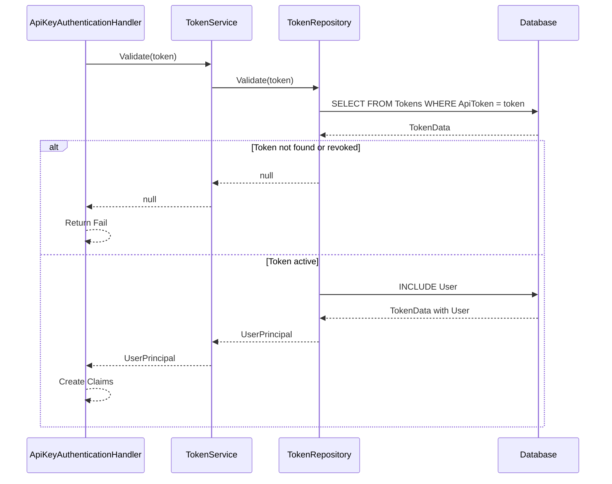
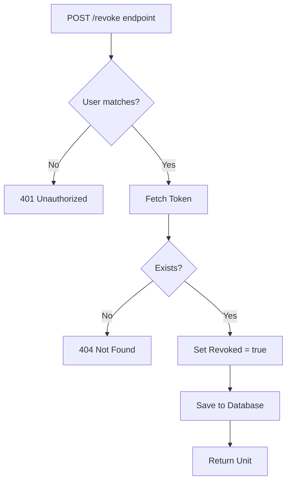

# Token Management Feature

**What**: API token CRUD operations with validation and revocation.
**Why**: Enables service-to-service authentication via API keys.

**Key Files**:

- `Domain/Service/TokenService.cs` → `Create()`, `Validate()`, `Revoke()`, `Delete()`
- `App/Modules/Users/Data/TokenData.cs` → Token data model
- `App/Modules/Users/API/V1/UserController.cs` → Token endpoints

## Overview

The Token Management feature allows users to create, view, and revoke API tokens for service-to-service authentication. Tokens are 64-character random strings stored in plaintext with a revocation flag.

## Token Lifecycle



## Token Model

```csharp
public record TokenData
{
    public Guid Id { get; set; }
    public string Name { get; set; } = string.Empty;
    public string ApiToken { get; set; } = string.Empty;
    public bool Revoked { get; set; } = false;
    public string UserId { get; set; } = string.Empty;
    public UserData User { get; set; } = new();
}
```

**Key File**: `App/Modules/Users/Data/TokenData.cs`

## Operations

| Operation | Endpoint                                        | Purpose            |
| --------- | ----------------------------------------------- | ------------------ |
| Search    | `GET /api/v1/user/{id}/token`                   | List user's tokens |
| Get       | `GET /api/v1/user/{id}/token/{tokenId}`         | Get specific token |
| Create    | `POST /api/v1/user/{id}/token`                  | Create new token   |
| Update    | `PUT /api/v1/user/{id}/token/{tokenId}`         | Update token name  |
| Revoke    | `POST /api/v1/user/{id}/token/{tokenId}/revoke` | Revoke token       |
| Delete    | `DELETE /api/v1/user/{id}/token/{tokenId}`      | Delete token       |

## Flow

### Create Token Sequence



**Key File**: `Domain/Service/TokenService.cs:19-24`

### Validate Token Sequence



**Key File**: `Domain/Service/TokenService.cs:36-39`

### Revoke Token Flow



**Key File**: `Domain/Service/TokenService.cs:31-34`

## Token Generation

Tokens are generated using the `PasswordGenerator` library:

```csharp
public string Generate()
{
    var pwd = new Password()
        .IncludeLowercase()
        .IncludeNumeric()
        .IncludeUppercase()
        .LengthRequired(64);
    return pwd.Next();
}
```

**Key File**: `Domain/Service/ApiKeyGenerator.cs:7-15`

## Edge Cases

| Case                         | Behavior                      | Key File                              |
| ---------------------------- | ----------------------------- | ------------------------------------- |
| Validate non-existent token  | Returns null                  | `TokenService.cs:36-39`               |
| Validate revoked token       | Returns null                  | Repository filters `Revoked == false` |
| Create duplicate name        | Database constraint violation | `MainDbContext.cs`                    |
| Revoke already revoked token | No-op (idempotent)            | `TokenService.cs:31-34`               |

## Security Considerations

- **Plaintext Storage**: Tokens are stored in plaintext (NOT hashed)
- **Single Use**: Token is shown only on creation
- **Revocation**: Soft delete (sets `Revoked = true`)
- **User Ownership**: Users can only manage their own tokens

## Related

- [Authentication Concept](../concepts/01-authentication.md) - How tokens are used
- [Authentication Feature](./01-authentication.md) - Token validation in auth flow
- [User Module](../modules/02-users.md) - User and token data models
- [User API](../surfaces/api/04-user.md) - Token endpoints
