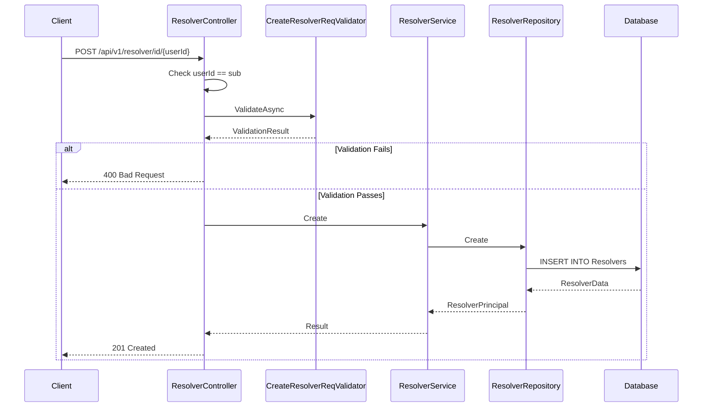

# Resolver Registry Feature

**What**: CRUD operations for resolvers with versioning.
**Why**: Stores resolver component definitions for template processing.

**Key Files**:

- `Domain/Service/ResolverService.cs` → `Create()`, `Update()`, `Delete()`
- `App/Modules/Cyan/Data/Repositories/ResolverRepository.cs` → Data access
- `App/Modules/Cyan/API/V1/Controllers/ResolverController.cs` → Endpoints

## Overview

The Resolver Registry manages resolver components. Like processors and plugins, resolvers contain metadata and versions. Resolvers can be referenced by template versions as dependencies.

For the conceptual overview of registry structure, see [Registry Concept](../concepts/03-registry.md). For version management, see [Version Concept](../concepts/04-version.md).

## Operations

| Operation   | Endpoint                                        | Key File                |
| ----------- | ----------------------------------------------- | ----------------------- |
| Search      | `GET /api/v1/resolver`                          | `ResolverController.cs` |
| Get by ID   | `GET /api/v1/resolver/id/{userId}/{id:guid}`    | `ResolverController.cs` |
| Get by slug | `GET /api/v1/resolver/slug/{username}/{name}`   | `ResolverController.cs` |
| Create      | `POST /api/v1/resolver/id/{userId}`             | `ResolverController.cs` |
| Update      | `PUT /api/v1/resolver/id/{userId}/{id}`         | `ResolverController.cs` |
| Delete      | `DELETE /api/v1/resolver/id/{userId}/{id:guid}` | `ResolverController.cs` |

## Flow

### Create Resolver Sequence



## Version Operations

Resolvers support versioning. For details on version management, see [Version Concept](../concepts/04-version.md).

| Operation            | Endpoint                                                      |
| -------------------- | ------------------------------------------------------------- |
| List versions        | `GET /api/v1/resolver/slug/{username}/{name}/versions`        |
| Get latest version   | `GET /api/v1/resolver/slug/{username}/{name}/versions/latest` |
| Get specific version | `GET /api/v1/resolver/slug/{username}/{name}/versions/{ver}`  |
| Create version       | `POST /api/v1/resolver/slug/{username}/{name}/versions`       |
| Update version       | `PUT /api/v1/resolver/id/{userId}/{id}/versions/{ver}`        |
| Push (upsert)        | `POST /api/v1/resolver/push/{username}`                       |
| Get version by ID    | `GET /api/v1/resolver/versions/{versionId:guid}`              |

## Resolver Model

```csharp
public record ResolverData
{
  public Guid Id { get; set; }
  public uint Downloads { get; set; }
  public string Name { get; set; } = string.Empty;
  public string Project { get; set; } = string.Empty;
  public string Source { get; set; } = string.Empty;
  public string Email { get; set; } = string.Empty;
  public string[] Tags { get; set; } = Array.Empty<string>();
  public string Description { get; set; } = string.Empty;
  public string Readme { get; set; } = string.Empty;
  public NpgsqlTsVector SearchVector { get; set; } = null!;
  public string UserId { get; set; } = string.Empty;
  public UserData User { get; set; } = null!;
  public IEnumerable<ResolverVersionData> Versions { get; set; } = null!;
  public IEnumerable<ResolverLikeData> Likes { get; set; } = null!;
}
```

**Key File**: `App/Modules/Cyan/Data/Models/ResolverData.cs`

## Edge Cases

| Case                         | Behavior         |
| ---------------------------- | ---------------- |
| Duplicate name (same user)   | 409 Conflict     |
| Update non-existent resolver | 404 Not Found    |
| Delete non-existent resolver | 404 Not Found    |
| User mismatch                | 401 Unauthorized |

## Dependency References

Resolvers are referenced by template versions. When a template version is created, it validates that all referenced resolver versions exist.

**Key File**: `Domain/Service/TemplateService.cs`

## Search Functionality

Resolvers support full-text search similar to templates and processors.

**Key File**: `App/Modules/Cyan/Data/Repositories/ResolverRepository.cs`

## Like System

Resolvers support user likes:

| Operation | Endpoint                                                            | Purpose           |
| --------- | ------------------------------------------------------------------- | ----------------- |
| Like      | `POST /api/v1/resolver/slug/{username}/{name}/like/{likerId}/true`  | Like a resolver   |
| Unlike    | `POST /api/v1/resolver/slug/{username}/{name}/like/{likerId}/false` | Unlike a resolver |

## Related

- [Registry Concept](../concepts/03-registry.md) - Registry entity structure
- [Version Concept](../concepts/04-version.md) - Version management
- [Dependency Concept](../concepts/05-dependency.md) - How templates reference resolvers
- [Like System Feature](./07-like-system.md) - Like/unlike functionality
- [Cyan Module](../modules/02-cyan.md) - Code organization
- [Resolver API](../surfaces/api/06-resolver.md) - API endpoints
