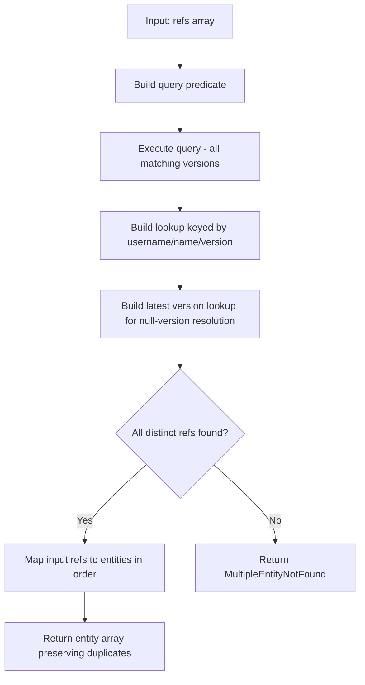

# Batch Reference Resolution

**What**: Resolve multiple entity references in a single batch operation.
**Why**: Efficiently fetch and validate dependencies during template version creation.

**Key Files**:

- `App/Modules/Cyan/Data/Repositories/PluginRepository.cs` → `GetAllVersion()`
- `App/Modules/Cyan/Data/Repositories/ProcessorRepository.cs` → `GetAllVersion()`
- `App/Modules/Cyan/Data/Repositories/TemplateRepository.cs` → `GetAllVersion()`
- `App/Modules/Cyan/Data/Repositories/ResolverRepository.cs` → `GetAllVersion()`

## Overview

Batch reference resolution is used when creating template versions that depend on multiple processors, plugins, templates, and resolvers. The `GetAllVersion` methods in each repository handle the resolution of multiple entity references in a single database query.

## Reference Types

Each reference type contains the same structure:

| Field      | Type     | Description                               |
| ---------- | -------- | ----------------------------------------- |
| `Username` | `string` | Owner's username                          |
| `Name`     | `string` | Entity name                               |
| `Version`  | `ulong?` | Optional specific version (null = latest) |

| Reference Type        | Repository            | Return Type                   |
| --------------------- | --------------------- | ----------------------------- |
| `PluginVersionRef`    | `PluginRepository`    | `PluginVersionPrincipal`      |
| `ProcessorVersionRef` | `ProcessorRepository` | `ProcessorVersionPrincipal`   |
| `TemplateVersionRef`  | `TemplateRepository`  | `TemplateVersionPrincipal`    |
| `ResolverVersionRef`  | `ResolverRepository`  | `ResolverVersionWithIdentity` |

## Output Guarantees

| Guarantee           | Description                                        |
| ------------------- | -------------------------------------------------- |
| Order preservation  | Output array order matches input array order       |
| Duplicate handling  | Duplicate refs return duplicate entity instances   |
| Version resolution  | Null version resolves to highest available version |
| Error deduplication | `notFound` errors list distinct missing refs only  |

## Algorithm



### Step Details

1. **Build Query Predicate**: Create an OR predicate matching all refs, handling versionless refs by matching any version
2. **Execute Query**: Fetch all matching versions in a single database round-trip
3. **Build Lookup**: Create dictionary keyed by `(username, name, version)` for O(1) entity access
4. **Build Latest Version Lookup**: Create dictionary keyed by `(username, name)` for null-version resolution
5. **Check for Missing**: Compare distinct input refs against found entities
6. **Map Results**: Iterate through input refs in order, using appropriate version (specified or latest)

## Example Scenarios

### Duplicate References

```csharp
// Input: ["a/b:1", "a/b:1"]
// Output: [entity_a_b_v1, entity_a_b_v1]
// Behavior: Same entity returned twice, preserving input order and duplicates
```

### Mixed Order and Duplicates

```csharp
// Input: ["a/b:1", "c/d:1", "a/b:1"]
// Output: [entity_a_b_v1, entity_c_d_v1, entity_a_b_v1]
// Behavior: Order preserved, duplicates preserved
```

### Null Version (Latest) Resolution

```csharp
// Input: ["a/b", "a/b"]
// Assuming a/b has versions [1, 2, 3], latest is 3
// Output: [entity_a_b_v3, entity_a_b_v3]
// Behavior: Null versions resolve to latest, duplicates preserved
```

### Multiple Specific Versions

```csharp
// Input: ["a/b:1", "a/b:2"]
// Output: [entity_a_b_v1, entity_a_b_v2]
// Behavior: Different versions are distinct entities
```

### Missing Entity Error

```csharp
// Input: ["a/b:1", "x/y:1", "a/b:1"]
// Assuming x/y doesn't exist
// Error: MultipleEntityNotFound { notFound = ["x/y:1"], found = ["a/b:1"] }
// Behavior: Error lists distinct missing refs only
```

## Edge Cases

| Case                        | Input                       | Behavior                                   |
| --------------------------- | --------------------------- | ------------------------------------------ |
| Empty input                 | `[]`                        | Returns empty array                        |
| All duplicates              | `["ref", "ref", "ref"]`     | Returns `[entity, entity, entity]`         |
| All null versions           | `["a/b", "a/b"]`            | Resolves both to latest version            |
| Mixed null and specific     | `["a/b", "a/b:1"]`          | Returns `[entity_latest, entity_v1]`       |
| Missing with duplicates     | `["a/b", "missing", "a/b"]` | Error: `notFound = ["missing"]` (distinct) |
| Different versions distinct | `["a/b:1", "a/b:2"]`        | Both versions must exist                   |

## Integration with Template Creation

This feature is primarily used during template version creation in `TemplateService`:

```csharp
// TemplateService.cs:160-196
var pluginResults = await plugin.GetAllVersion(plugins);
var processorResults = await processor.GetAllVersion(processors);
var templateResults = await repo.GetAllVersion(templates);
var resolverResults = await resolver.GetAllVersion(resolvers);

// Combine results using LINQ monadic comprehension
var a = from p in pluginResults
        from pr in processorResults
        from t in templateResults
        from r in resolverResults
        select (p, pr, t, r);
```

## Error Handling

| Error                    | Cause                        | HTTP Status |
| ------------------------ | ---------------------------- | ----------- |
| `MultipleEntityNotFound` | One or more refs don't exist | 404         |
| Database error           | Query execution failure      | 500         |

## Related

- [Dependency Resolution Algorithm](../algorithms/01-dependency-resolution.md) - Algorithm details
- [Template Registry Feature](./03-template-registry.md) - Primary consumer
- [Plugin Registry Feature](./05-plugin-registry.md) - Plugin references
- [Processor Registry Feature](./04-processor-registry.md) - Processor references
- [Resolver Registry Feature](./09-resolver-registry.md) - Resolver references
