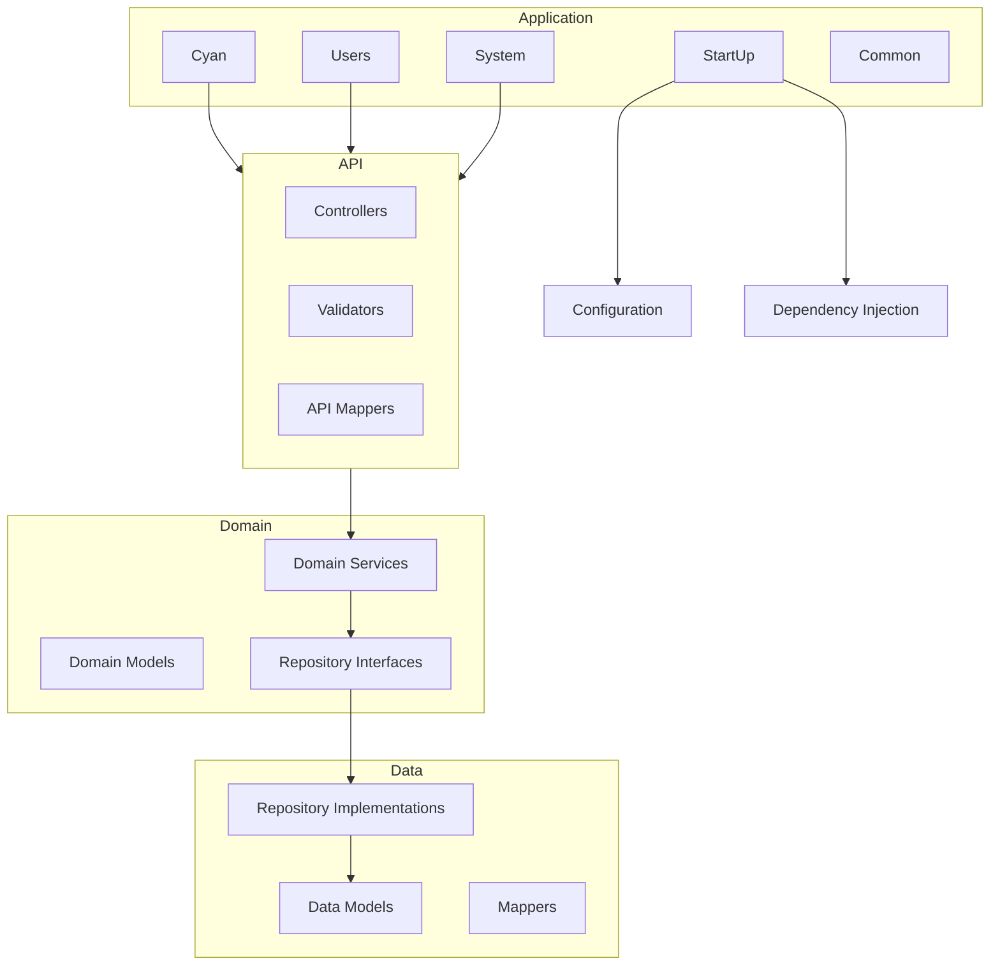
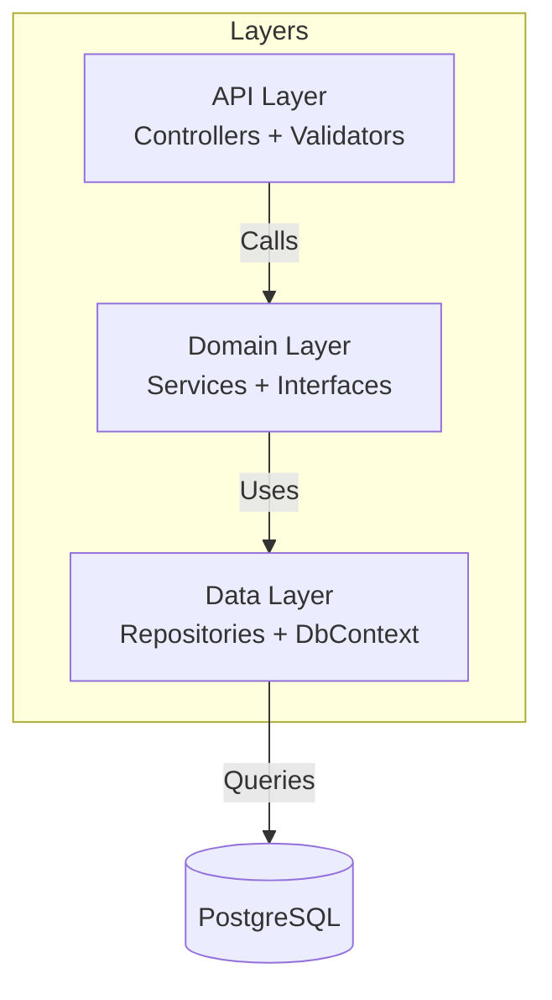
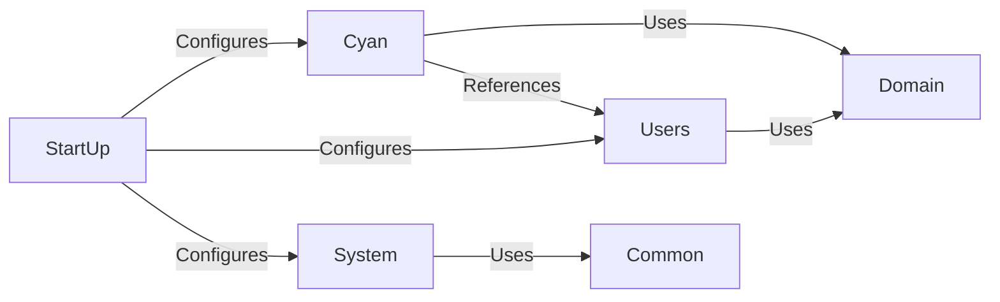

# Modules Overview

This section documents the code organization and structure of the Zinc application.

## Module Map



## Module Index

| Module | Purpose | Key Files | Dependencies |
|--------|---------|-----------|--------------|
| [StartUp](./01-startup.md) | Configuration, DI setup | `App/StartUp/` | All modules |
| [Cyan](./02-cyan.md) | Templates, Processors, Plugins | `App/Modules/Cyan/` | Domain, Users |
| [Users](./03-users.md) | User management, tokens | `App/Modules/Users/` | Domain |
| [System](./04-system.md) | Health, error handling | `App/Modules/System/` | Common, Domain |
| [Common](./05-common.md) | Shared components | `App/Modules/Common/` | None |

## Layer Architecture



## File Organization

```text
App/
├── StartUp/              # Configuration and DI
│   ├── Services/         # Service configurations
│   ├── Registry/         # Component registries
│   ├── Options/          # Configuration options
│   └── Database/         # Database setup
│
├── Modules/
│   ├── Cyan/             # Templates, Processors, Plugins
│   │   ├── API/          # Controllers and validators
│   │   └── Data/         # Repositories and models
│   ├── Users/            # User management
│   │   ├── API/          # Controllers and validators
│   │   └── Data/         # Repositories and models
│   ├── System/           # System health
│   │   └── API/          # Controllers
│   └── Common/           # Shared components
│       └── API/          # Base controllers
│
├── Error/                # Error types
└── Migrations/           # Database migrations

Domain/
├── Model/                # Domain models
├── Service/              # Business logic
└── Repository/           # Repository interfaces
```

## Module Relationships



## Responsibilities

| Module | Responsibilities |
|--------|-----------------|
| **StartUp** | App initialization, DI configuration, middleware setup |
| **Cyan** | Template/Processor/Plugin CRUD, versioning, search |
| **Users** | User CRUD, token management, authentication |
| **System** | Health checks, error documentation |
| **Common** | Shared controller base classes, utilities |

## Key Interfaces

| Interface | Implementations | Purpose |
|-----------|----------------|---------|
| `ITemplateService` | `TemplateService` | Template business logic |
| `IProcessorService` | `ProcessorService` | Processor business logic |
| `IPluginService` | `PluginService` | Plugin business logic |
| `IUserService` | `UserService` | User business logic |
| `ITokenService` | `TokenService` | Token business logic |

## Related Sections

- [Features](../features/) - Functional capabilities
- [Concepts](../concepts/) - Domain terminology
- [Algorithms](../algorithms/) - Implementation details
