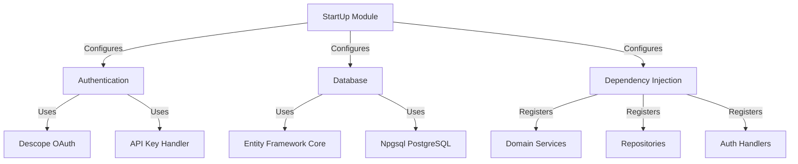
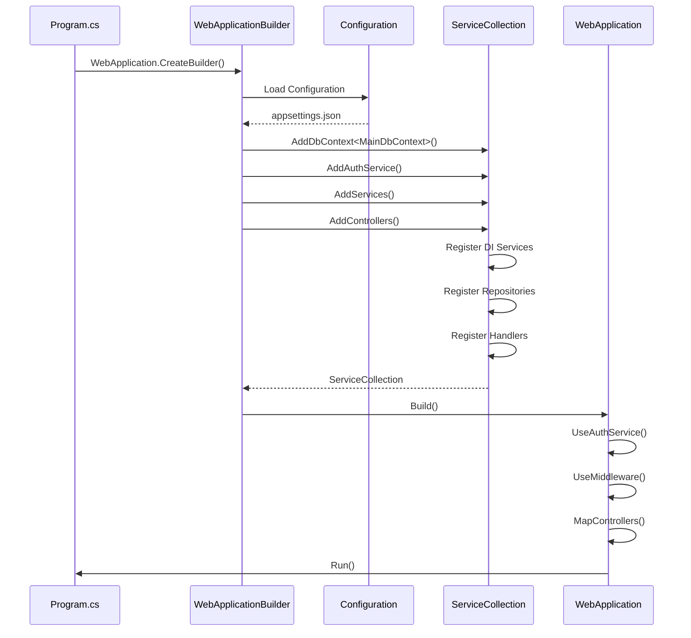

# StartUp Module

**What**: Application initialization, dependency injection configuration, and middleware setup.
**Why**: Centralizes all configuration and bootstrapping logic.

**Key Files**:

- `App/StartUp/Services/AuthService.cs` → Authentication setup
- `App/StartUp/Database/MainDbContext.cs` → Database configuration
- `App/StartUp/Registry/` → Service registration
- `App/Program.cs` → Application entry point

## Responsibilities

- Application initialization and configuration
- Dependency injection container setup
- Authentication and authorization configuration
- Database context configuration
- Middleware pipeline setup
- CORS and error handling setup

## Structure

```text
App/StartUp/
├── Services/              # Service configurations
│   ├── AuthService.cs     # JWT + API Key setup
│   └── Auth/              # Authorization handlers
│       ├── HasAnyHandler.cs
│       └── HasAllHandler.cs
├── Database/              # Database setup
│   └── MainDbContext.cs   # EF Core context
├── Registry/              # Service registries
│   ├── AuthPolicies.cs    # Policy names
│   └── Services/          # Service registration
├── Options/               # Configuration classes
│   └── Auth/
│       └── AuthOption.cs  # Auth settings
└── Server.cs              # WebApplication setup
```

## Dependencies



## Key Interfaces

### AuthService

Configures dual authentication scheme (JWT + API Key):

```csharp
public static class AuthService
{
    public static IServiceCollection AddAuthService(
        this IServiceCollection services,
        AuthOption o
    )
    {
        // Register authorization handlers
        services
            .AddSingleton<IAuthorizationHandler, HasAnyHandler>()
            .AddSingleton<IAuthorizationHandler, HasAllHandler>();

        // Configure authentication
        services
            .AddAuthentication(options =>
            {
                options.DefaultScheme = "MultiAuthSchemes";
            })
            .AddJwtBearer(/* ... */)
            .AddScheme<ApiKeyAuthenticationOptions, ApiKeyAuthenticationHandler>(
                ApiKeyAuthenticationOptions.DefaultScheme,
                _ => { }
            )
            .AddPolicyScheme(/* ... */);

        // Configure authorization policies
        services.AddAuthorization(options =>
        {
            foreach (var (name, policy) in policies)
            {
                options.AddPolicy(name, /* ... */);
            }
        });

        return services;
    }
}
```

**Key File**: `App/StartUp/Services/AuthService.cs`

### MainDbContext

Entity Framework Core database context:

```csharp
public class MainDbContext : DbContext
{
    public DbSet<TemplateData> Templates { get; set; }
    public DbSet<ProcessorData> Processors { get; set; }
    public DbSet<PluginData> Plugins { get; set; }
    public DbSet<UserData> Users { get; set; }
    public DbSet<TokenData> Tokens { get; set; }

    protected override void OnModelCreating(ModelBuilder modelBuilder)
    {
        // Configure entity relationships
        // Configure indexes
        // Configure full-text search
    }
}
```

**Key File**: `App/StartUp/Database/MainDbContext.cs`

## Configuration Flow



## Configuration Options

### AuthOption

```csharp
public class AuthOption
{
    public bool Enabled { get; set; }
    public AuthSettings? Settings { get; set; }
}

public class AuthSettings
{
    public string Domain { get; set; }
    public string Audience { get; set; }
    public string Issuer { get; set; }
    public Dictionary<string, AuthPolicyOption>? Policies { get; set; }
}

public class AuthPolicyOption
{
    public string Type { get; set; }  // "Any" or "All"
    public string Field { get; set; } // "scope", "roles", etc.
    public string[] Target { get; set; }
}
```

**Key File**: `App/StartUp/Options/Auth/AuthOption.cs`

## AuthPolicies Registry

Policy name constants for use in controllers:

```csharp
public static class AuthPolicies
{
    public const string OnlyAdmin = "AdminOnly";
    public const string ReadAccess = "ReadAccess";
    public const string WriteAccess = "WriteAccess";
}
```

**Key File**: `App/StartUp/Registry/AuthPolicies.cs`

## Related

- [Authentication Feature](../features/01-authentication.md) - Auth implementation
- [Authorization Feature](../features/02-authorization.md) - Policy implementation
- [Database (FTS Configuration)](../features/06-full-text-search.md#database-configuration) - DB configuration
