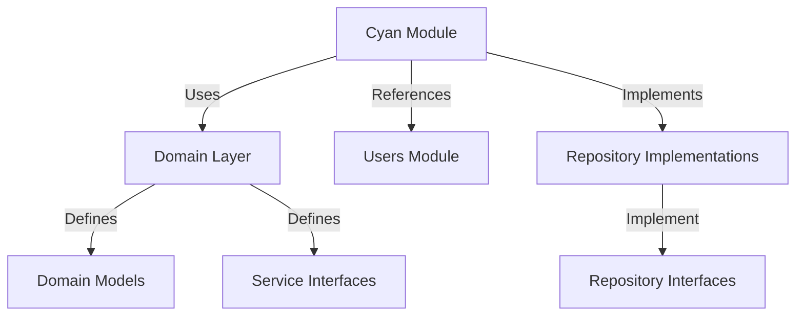
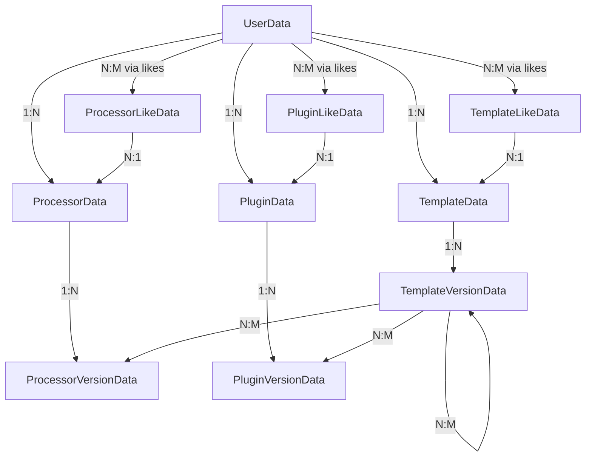
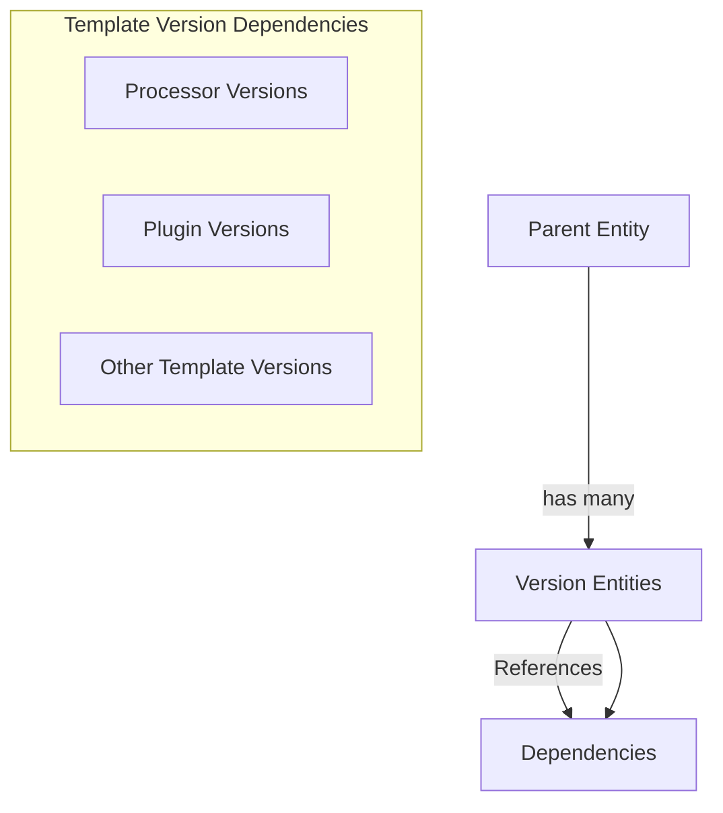

# Cyan Module

**What**: Manages templates, processors, and plugins (the "Cyan" registries).
**Why**: Provides core CI/CD artifact storage and versioning.

**Key Files**:

- `App/Modules/Cyan/API/V1/Controllers/TemplateController.cs` → Template endpoints
- `App/Modules/Cyan/Data/Repositories/TemplateRepository.cs` → Template data access
- `Domain/Service/TemplateService.cs` → Template business logic
- `App/Modules/Cyan/API/V1/Controllers/ProcessorController.cs` → Processor endpoints
- `App/Modules/Cyan/Data/Repositories/ProcessorRepository.cs` → Processor data access
- `App/Modules/Cyan/API/V1/Controllers/PluginController.cs` → Plugin endpoints
- `App/Modules/Cyan/Data/Repositories/PluginRepository.cs` → Plugin data access

## Responsibilities

- Template CRUD operations
- Processor CRUD operations
- Plugin CRUD operations
- Version management for all three entity types
- Full-text search across all entities
- Like/unlike functionality
- Dependency resolution for templates

## Structure

```text
App/Modules/Cyan/
├── API/
│   └── V1/
│       ├── Controllers/
│       │   ├── TemplateController.cs
│       │   ├── ProcessorController.cs
│       │   └── PluginController.cs
│       ├── Models/          # Request/Response DTOs
│       ├── Mappers/         # DTO to Domain mapping
│       └── Validators/      # FluentValidation validators
└── Data/
    ├── Models/              # Database entities
    │   ├── TemplateData.cs
    │   ├── ProcessorData.cs
    │   ├── PluginData.cs
    │   ├── *VersionData.cs
    │   └── LikeData.cs
    ├── Repositories/        # Repository implementations
    │   ├── TemplateRepository.cs
    │   ├── ProcessorRepository.cs
    │   └── PluginRepository.cs
    └── Mappers/             # Data to Domain mapping
```

## Dependencies



## Key Components

### Controllers

| Controller            | Purpose                  | Key File                 |
| --------------------- | ------------------------ | ------------------------ |
| `TemplateController`  | Template HTTP endpoints  | `TemplateController.cs`  |
| `ProcessorController` | Processor HTTP endpoints | `ProcessorController.cs` |
| `PluginController`    | Plugin HTTP endpoints    | `PluginController.cs`    |

### Repositories

| Repository            | Purpose               | Key File                 |
| --------------------- | --------------------- | ------------------------ |
| `TemplateRepository`  | Template data access  | `TemplateRepository.cs`  |
| `ProcessorRepository` | Processor data access | `ProcessorRepository.cs` |
| `PluginRepository`    | Plugin data access    | `PluginRepository.cs`    |

### Data Models

| Model                  | Purpose                   | Key File                  |
| ---------------------- | ------------------------- | ------------------------- |
| `TemplateData`         | Template database entity  | `TemplateData.cs`         |
| `TemplateVersionData`  | Template version entity   | `TemplateVersionData.cs`  |
| `ProcessorData`        | Processor database entity | `ProcessorData.cs`        |
| `ProcessorVersionData` | Processor version entity  | `ProcessorVersionData.cs` |
| `PluginData`           | Plugin database entity    | `PluginData.cs`           |
| `PluginVersionData`    | Plugin version entity     | `PluginVersionData.cs`    |
| `*LikeData`            | Like entities             | `LikeData.cs`             |

## Entity Relationships



## Repository Operations

Each repository implements the same interface pattern:

```csharp
public interface ITemplateRepository
{
    Task<Result<IEnumerable<TemplatePrincipal>>> Search(TemplateSearch search);
    Task<Result<Template?>> Get(string userId, Guid id);
    Task<Result<Template?>> Get(string username, string name);
    Task<Result<TemplatePrincipal>> Create(string userId, TemplateRecord record, TemplateMetadata metadata);
    Task<Result<TemplatePrincipal?>> Update(string userId, Guid id, TemplateMetadata metadata);
    Task<Result<TemplatePrincipal?>> Update(string username, string name, TemplateMetadata metadata);
    Task<Result<Unit?>> Delete(string userId, Guid id);
    Task<Result<Unit?>> Like(string likerId, string username, string name, bool like);
    Task<Result<uint?>> IncrementDownload(string username, string name);
    // ... version operations
}
```

## Version Management

All three entities support versioning:



**Key Files**:

- `TemplateVersionData.cs`
- `ProcessorVersionData.cs`
- `PluginVersionData.cs`

## Full-Text Search

All entities use PostgreSQL `tsvector` for search:

```csharp
public record TemplateData
{
    // ... other fields
    public NpgsqlTsVector SearchVector { get; set; } = null!;
}
```

**Key File**: `App/Modules/Cyan/Data/Models/TemplateData.cs:26`

## Like System

Separate like tables for each entity:

```csharp
public record TemplateLikeData
{
    public Guid Id { get; set; }
    public Guid TemplateId { get; set; }
    public TemplateData Template { get; set; } = null!;
    public string UserId { get; set; } = string.Empty;
    public UserData User { get; set; } = null!;
}
```

**Key File**: `App/Modules/Cyan/Data/Models/LikeData.cs:5-14`

## Related

- [Template Registry Feature](../features/03-template-registry.md) - Template operations
- [Processor Registry Feature](../features/04-processor-registry.md) - Processor operations
- [Plugin Registry Feature](../features/05-plugin-registry.md) - Plugin operations
- [Full-Text Search Feature](../features/06-full-text-search.md) - Search implementation
- [Like System Feature](../features/07-like-system.md) - Like implementation
