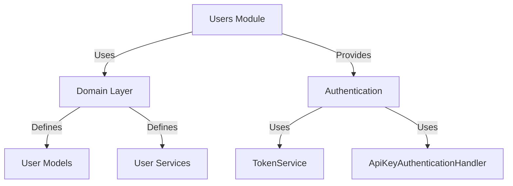
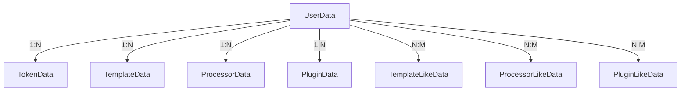

# Users Module

**What**: User account management and API token authentication.
**Why**: Handles user identities and service-to-service authentication.

**Key Files**:

- `App/Modules/Users/API/V1/UserController.cs` → User endpoints
- `App/Modules/Users/Data/UserRepository.cs` → User data access
- `Domain/Service/UserService.cs` → User business logic
- `Domain/Service/TokenService.cs` → Token business logic

## Responsibilities

- User CRUD operations
- User search and lookup
- API token creation and management
- Token validation for authentication
- Token revocation

## Structure

```text
App/Modules/Users/
├── API/
│   └── V1/
│       ├── UserController.cs           # User endpoints
│       ├── Models/                     # Request/Response DTOs
│       ├── Mappers/                    # DTO to Domain mapping
│       ├── Validators/                 # FluentValidation validators
│       └── Auth/
│           └── ApiKeyAuthenticationOptions.cs  # API Key handler
└── Data/
    ├── Models/                         # Database entities
    │   ├── UserData.cs
    │   └── TokenData.cs
    ├── UserRepository.cs               # User repository
    ├── TokenRepository.cs              # Token repository
    ├── UserMapper.cs                   # User entity mapping
    └── TokenMapper.cs                  # Token entity mapping
```

## Dependencies



## Key Components

### UserController

User HTTP endpoints:

| Endpoint                                             | Method | Purpose                  |
| ---------------------------------------------------- | ------ | ------------------------ |
| `/api/v1/user`                                       | GET    | List users (admin only)  |
| `/api/v1/user/Me`                                    | GET    | Get current user ID      |
| `/api/v1/user/{id}`                                  | GET    | Get user by ID           |
| `/api/v1/user/username/{username}`                   | GET    | Get user by username     |
| `/api/v1/user/exist/{username}`                      | GET    | Check if user exists     |
| `/api/v1/user`                                       | POST   | Create user              |
| `/api/v1/user/{id}`                                  | PUT    | Update user              |
| `/api/v1/user/{id:guid}`                             | DELETE | Delete user (admin only) |
| `/api/v1/user/{userId}/tokens`                       | GET    | List user tokens         |
| `/api/v1/user/{userId}/tokens`                       | POST   | Create token             |
| `/api/v1/user/{userId}/tokens/{tokenId:guid}`        | PUT    | Update token             |
| `/api/v1/user/{userId}/tokens/{tokenId:guid}/revoke` | POST   | Revoke token             |
| `/api/v1/user/{userId}/tokens/{tokenId:guid}`        | DELETE | Delete token             |

**Key File**: `App/Modules/Users/API/V1/UserController.cs`

### UserRepository

User data access operations:

```csharp
public interface IUserRepository
{
    Task<Result<IEnumerable<UserPrincipal>>> Search(UserSearch search);
    Task<Result<User?>> GetById(string id);
    Task<Result<User?>> GetByUsername(string username);
    Task<Result<bool>> Exists(string username);
    Task<Result<UserPrincipal>> Create(UserRecord record);
    Task<Result<UserPrincipal?>> Update(string id, UserMetadata metadata);
    Task<Result<Unit?>> Delete(string id);
}
```

**Key File**: `App/Modules/Users/Data/UserRepository.cs`

### TokenRepository

Token data access operations:

```csharp
public interface ITokenRepository
{
    Task<Result<IEnumerable<TokenPrincipal>>> Search(string userId);
    Task<Result<Token?>> Get(string userId, Guid id);
    Task<Result<TokenPrincipal>> Create(string userId, string token, TokenRecord record);
    Task<Result<TokenPrincipal?>> Update(string userId, Guid id, TokenRecord record);
    Task<Result<Unit?>> Revoke(string userId, Guid id);
    Task<Result<UserPrincipal?>> Validate(string token);
    Task<Result<Unit?>> Delete(string userId, Guid id);
}
```

**Key File**: `App/Modules/Users/Data/TokenRepository.cs`

### ApiKeyAuthenticationHandler

Custom authentication handler for API tokens:

```csharp
public class ApiKeyAuthenticationHandler : AuthenticationHandler<ApiKeyAuthenticationOptions>
{
    protected override async Task<AuthenticateResult> HandleAuthenticateAsync()
    {
        // Check X-API-TOKEN header
        if (!Request.Headers.TryGetValue(Options.TokenHeaderName, out var value))
            return AuthenticateResult.Fail($"Missing header: {Options.TokenHeaderName}");

        // Validate token
        var userResult = await token.Validate(value);
        if (userResult.IsFailure() || userResult.Get() == null)
            return AuthenticateResult.Fail("Invalid token");

        // Create claims
        var user = userResult.Get();
        var claims = new List<Claim>
        {
            new("sub", user.Id),
            new("username", user.Record.Username)
        };

        var ticket = new AuthenticationTicket(
            new ClaimsPrincipal(new ClaimsIdentity(claims, Scheme.Name)),
            Scheme.Name
        );

        return AuthenticateResult.Success(ticket);
    }
}
```

**Key File**: `App/Modules/Users/API/Auth/ApiKeyAuthenticationOptions.cs:15-50`

## Data Models

### UserData

```csharp
public record UserData
{
    public string Id { get; set; } = string.Empty;
    public string Username { get; set; } = string.Empty;

    // Foreign Keys
    public IEnumerable<TokenData> Tokens { get; set; } = null!;
    public IEnumerable<TemplateData> Templates { get; set; } = null!;
    public IEnumerable<PluginData> Plugins { get; set; } = null!;
    public IEnumerable<ProcessorData> Processors { get; set; } = null!;
    public IEnumerable<TemplateLikeData> TemplateLikes { get; set; } = null!;
    public IEnumerable<PluginLikeData> PluginLikes { get; set; } = null!;
    public IEnumerable<ProcessorLikeData> ProcessorLikes { get; set; } = null!;
}
```

**Key File**: `App/Modules/Users/Data/UserData.cs`

**Note**: Additional user properties like `Tags`, `Description`, and `Email` are stored in the domain layer (`UserRecord` and `UserMetadata`), not directly in the `UserData` entity.

### TokenData

```csharp
public record TokenData
{
    public Guid Id { get; set; }
    public string Name { get; set; } = string.Empty;
    public string ApiToken { get; set; } = string.Empty;
    public bool Revoked { get; set; } = false;
    public string UserId { get; set; } = string.Empty;
    public UserData User { get; set; } = null!;
}
```

**Key File**: `App/Modules/Users/Data/TokenData.cs`

## Entity Relationships



## Related

- [Authentication Feature](../features/01-authentication.md) - JWT + API Key auth
- [Token Management Feature](../features/08-token-management.md) - Token operations
- [Authentication Concept](../concepts/01-authentication.md) - Auth concepts
