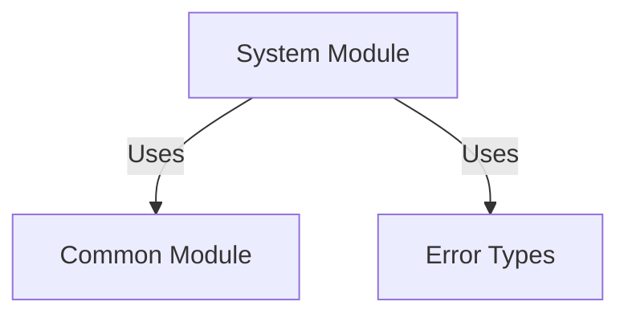
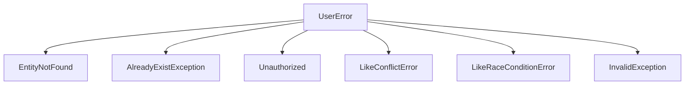

# System Module

**What**: System health monitoring and error documentation.
**Why**: Provides observability and API error documentation.

**Key Files**:

- `App/Modules/System/SystemController.cs` → System info endpoint
- `App/Modules/System/V1ErrorController.cs` → Error documentation

## Responsibilities

- Health check endpoint
- Error code documentation
- System information

## Structure

```text
App/Modules/System/
├── SystemController.cs        # System info endpoint
└── V1ErrorController.cs       # Error documentation
```

## Dependencies



## Key Components

### SystemController

Provides system health and information:

```csharp
[ApiVersionNeutral]
[ApiController]
[Route("/")]
public class SystemController : AtomiControllerBase
{
    [HttpGet]
    public ActionResult<object> SystemInfo()
    {
        return Ok(new
        {
            Landscape,
            Platform,
            Service,
            Module,
            Version,
            Status = "OK",
            TimeStamp = DateTime.UtcNow
        });
    }
}
```

**Key File**: `App/Modules/System/SystemController.cs:14-30`

### V1ErrorController

Documents all API error codes:

```csharp
[ApiController]
[ApiVersion(1.0)]
[Route("api/v{version:apiVersion}/error-info")]
public class V1ErrorController : AtomiControllerBase
{
    [HttpGet]
    public ActionResult<IEnumerable<string>> ErrorInfo()
    {
        return Ok(V1ProblemTypes
            .Select(x => Activator.CreateInstance(x) is IDomainProblem p ? p.Id : throw new InvalidOperationException($"Cannot create {x.FullName} as IDomainProblem")));
    }

    [HttpGet("{id}")]
    public ActionResult<ErrorInfo> Get(string id)
    {
        // Returns ErrorInfo with schema and problem details
    }
}
```

**Key File**: `App/Modules/System/V1ErrorController.cs:15-57`

## Endpoints

| Endpoint                      | Method | Purpose           | Response                                    |
| ----------------------------- | ------ | ----------------- | ------------------------------------------- |
| `GET /`                       | GET    | System info       | `{"landscape": "...", "status": "OK", ...}` |
| `GET /api/v1/error-info`      | GET    | List error types  | Array of error IDs                          |
| `GET /api/v1/error-info/{id}` | GET    | Get error details | ErrorInfo with schema                       |

## Error Types

The system uses a structured error hierarchy:



**Key Directory**: `App/Error/V1/`

## Related

- [Error Handling](./05-common.md#error-mapping) - Error patterns via MapError
- [API Errors](../surfaces/api/) - Endpoint-specific errors
