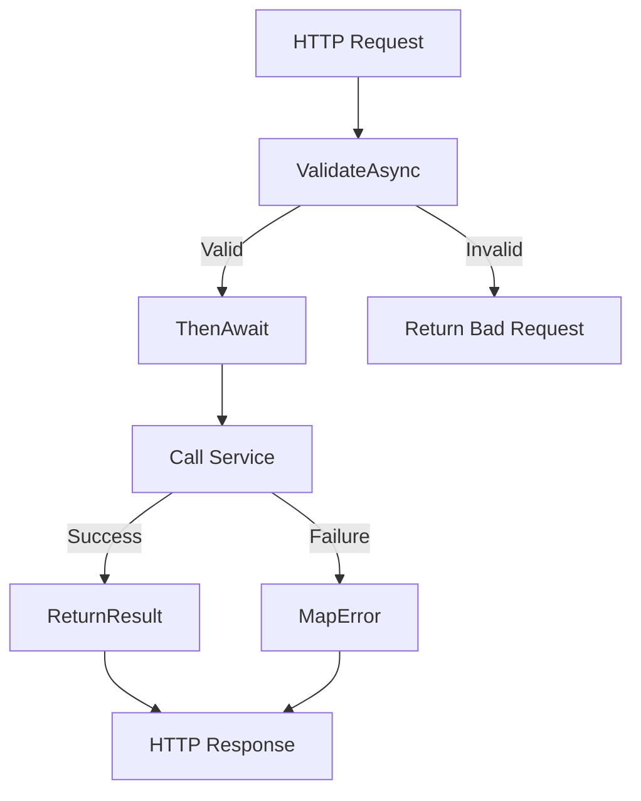

# Common Module

**What**: Shared components and base classes for the application.
**Why**: Reduces code duplication and provides consistent behavior.

**Key Files**:

- `App/Modules/Common/BaseController.cs` → `AtomiControllerBase`
- `App/Utility/` → Utility functions

## Responsibilities

- Base controller with common functionality
- Result handling utilities
- Error mapping
- Validation helpers

## Structure

```
App/Modules/Common/
└── BaseController.cs            # Base controller class (AtomiControllerBase)

App/Utility/
├── Utils.cs                     # Utility functions
├── ValidationUtility.cs         # Validation helpers
└── *.cs                         # Other utilities
```

## Key Components

### AtomiControllerBase

Base controller providing common functionality:

```csharp
public abstract class AtomiControllerBase : ControllerBase
{
    protected string? Sub()
    {
        return User.FindFirst("sub")?.Value;
    }

    protected ActionResult ReturnResult<T>(Result<T> result)
    {
        if (result.IsOk())
        {
            return Ok(result.Get());
        }
        return MapError(result.FailureOrDefault());
    }

    protected ActionResult ReturnNullableResult<T>(
        Result<T?> result,
        Exception notFoundError
    )
    {
        if (result.IsOk())
        {
            var value = result.Get();
            if (value == null)
                return NotFound(notFoundError.Message);
            return Ok(value);
        }
        return MapError(result.FailureOrDefault());
    }

    private ActionResult MapError(Exception error)
    {
        return error switch
        {
            UnauthorizedException => Unauthorized(error.Message),
            EntityNotFound => NotFound(error.Message),
            AlreadyExistException => Conflict(error.Message),
            _ => StatusCode(500, error.Message)
        };
    }
}
```

**Key File**: `App/Modules/Common/BaseController.cs`

## Common Patterns

### Result Handling

All controllers use the `Result<T>` pattern for consistent error handling:

```csharp
public async Task<ActionResult<TemplatePrincipalResp>> Create(
    string userId,
    [FromBody] CreateTemplateReq req
)
{
    var template = await createTemplateReqValidator
        .ValidateAsyncResult(req, "Invalid CreateTemplateReq")
        .ThenAwait(x => service.Create(userId, x.ToDomain().Item1, x.ToDomain().Item2))
        .Then(x => x.ToResp(), Errors.MapAll);

    return this.ReturnResult(template);
}
```

### Validation Flow



### Error Mapping

| Exception Type          | HTTP Status | Base Controller Method |
| ----------------------- | ----------- | ---------------------- |
| `UnauthorizedException` | 401         | `Unauthorized()`       |
| `EntityNotFound`        | 404         | `NotFound()`           |
| `AlreadyExistException` | 409         | `Conflict()`           |
| Other                   | 500         | `StatusCode(500)`      |

**Key File**: `App/Modules/Common/BaseController.cs`

## Related

- [Features](../features/) - Feature implementations using base controller
- [Surfaces](../surfaces/api/) - API endpoints
