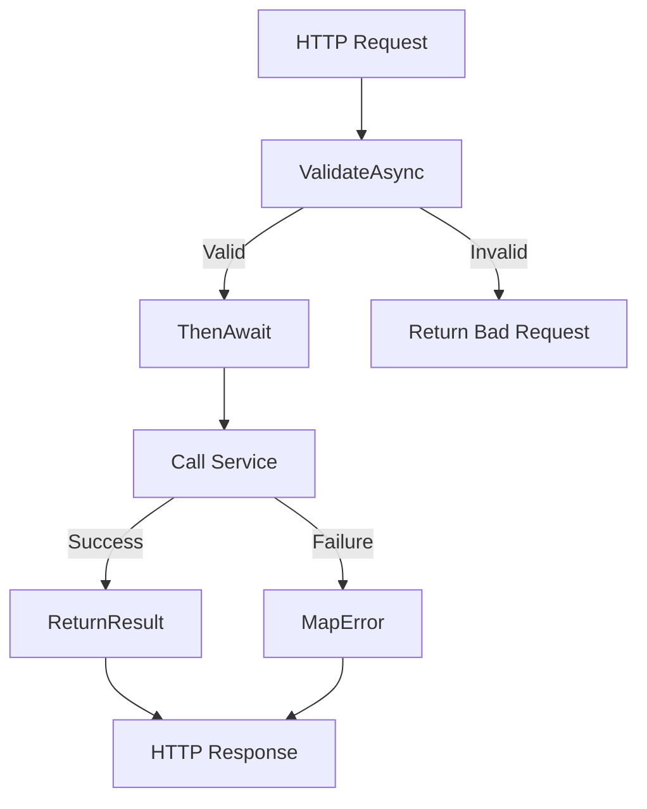

# Common Module

**What**: Shared components and base classes for the application.
**Why**: Reduces code duplication and provides consistent behavior.

**Key Files**:

- `App/Modules/Common/BaseController.cs` → `AtomiControllerBase`
- `App/Utility/` → Utility functions

## Responsibilities

- Base controller with common functionality
- Result handling utilities
- Error mapping
- Validation helpers

## Structure

```text
App/Modules/Common/
└── BaseController.cs            # Base controller class (AtomiControllerBase)

App/Utility/
├── Utils.cs                     # Utility functions
├── ValidationUtility.cs         # Validation helpers
└── *.cs                         # Other utilities
```

## Key Components

### AtomiControllerBase

Base controller providing common functionality using RFC 7807 Problem Details for error responses:

```csharp
public abstract class AtomiControllerBase : ControllerBase
{
    // Store IDomainProblem in HttpContext for RFC 7807 serialization
    protected ActionResult<T> Error<T>(HttpStatusCode code, IDomainProblem problem)
    {
        this.HttpContext.Items[Constants.ProblemContextKey] = problem;
        return this.StatusCode((int)code);
    }

    protected ActionResult Error(HttpStatusCode code, IDomainProblem problem)
    {
        this.HttpContext.Items[Constants.ProblemContextKey] = problem;
        return this.StatusCode((int)code);
    }

    protected string? Sub()
    {
        return this.HttpContext.User?.Identity?.Name;
    }

    protected ActionResult<T> ReturnResult<T>(Result<T> entity)
    {
        return entity.IsSuccess()
            ? this.Ok(entity.Get())
            : this.MapException<T>(entity.FailureOrDefault());
    }

    protected ActionResult<T> ReturnNullableResult<T>(Result<T?> entity, EntityNotFound notFound)
    {
        if (entity.IsSuccess())
        {
            var suc = entity.Get();
            return suc == null ? this.Error<T>(HttpStatusCode.NotFound, notFound) : this.Ok(suc);
        }
        var e = entity.FailureOrDefault();
        return this.MapException<T>(e);
    }

    private ActionResult MapException(Exception e)
    {
        return e switch
        {
            DomainProblemException d => d.Problem switch
            {
                EntityNotFound => this.Error(HttpStatusCode.NotFound, d.Problem),
                ValidationError validationError => this.Error(HttpStatusCode.BadRequest, validationError),
                Unauthorized unauthorizedError => this.Error(HttpStatusCode.Unauthorized, unauthorizedError),
                EntityConflict entityConflict => this.Error(HttpStatusCode.Conflict, entityConflict),
                LikeConflictError likeConflictError => this.Error(HttpStatusCode.Conflict, likeConflictError),
                LikeRaceConditionError likeRaceConditionError => this.Error(HttpStatusCode.Conflict, likeRaceConditionError),
                _ => this.Error(HttpStatusCode.BadRequest, d.Problem),
            },
            AlreadyExistException aee => this.Error(HttpStatusCode.Conflict, new EntityConflict(aee.Message, aee.t)),
            _ => throw new AggregateException("Unhandled Exception", e),
        };
    }
}
```

**Key File**: `App/Modules/Common/BaseController.cs`

## Common Patterns

### Result Handling

All controllers use the `Result<T>` pattern for consistent error handling:

```csharp
public async Task<ActionResult<TemplatePrincipalResp>> Create(
    string userId,
    [FromBody] CreateTemplateReq req
)
{
    var template = await createTemplateReqValidator
        .ValidateAsyncResult(req, "Invalid CreateTemplateReq")
        .ThenAwait(x => service.Create(userId, x.ToDomain().Item1, x.ToDomain().Item2))
        .Then(x => x.ToResp(), Errors.MapAll);

    return this.ReturnResult(template);
}
```

### Validation Flow

<!--
NOTE: This diagram intentionally shows only the validation flow (ValidateAsync → ThenAwait → Service).
Authorization is a separate concern handled at the controller level before validation.
See the Error Mapping table below for how UnauthorizedException maps to HTTP 401.
-->



### Error Mapping

| Exception Type          | HTTP Status | Base Controller Method |
| ----------------------- | ----------- | ---------------------- |
| `UnauthorizedException` | 401         | `Unauthorized()`       |
| `EntityNotFound`        | 404         | `NotFound()`           |
| `AlreadyExistException` | 409         | `Conflict()`           |
| Other                   | 500         | `StatusCode(500)`      |

**Key File**: `App/Modules/Common/BaseController.cs`

## Related

- [Features](../features/) - Feature implementations using base controller
- [Surfaces](../surfaces/api/) - API endpoints
