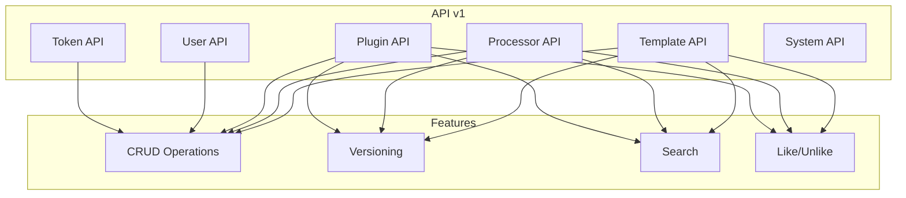

# API Overview

This section documents the HTTP API surfaces exposed by Zinc.

## API Map



## Base URL

```text
# Local development default
http://localhost:5000/api/v1
```

> In production, replace `localhost:5000` with the configured host.

## Authentication

All endpoints (except System API: `GET /`, `GET /api/v1/error-info`, `GET /api/v1/error-info/{id}`) require authentication:

| Method | Header | Example |
|--------|--------|---------|
| JWT | `Authorization: Bearer <token>` | `Authorization: Bearer eyJhbGc...` |
| API Key | `X-API-TOKEN: <key>` | `X-API-TOKEN: aB1cD2eF3...` |

**Key File**: `App/Modules/Users/API/Auth/ApiKeyAuthenticationOptions.cs`

## API Index

| Resource | Description | Documentation |
|----------|-------------|---------------|
| [Template](./01-template.md) | Template registry | `TemplateController.cs` |
| [Processor](./02-processor.md) | Processor registry | `ProcessorController.cs` |
| [Plugin](./03-plugin.md) | Plugin registry | `PluginController.cs` |
| [User](./04-user.md) | User management | `UserController.cs` |
| [Token](./04-user.md#get-user-tokens) | API token management | `UserController.cs` |
| [System](./05-system.md) | Health & errors | `SystemController.cs` |

## Common Patterns

### Response Format

Success responses use the entity's response DTO:

```json
{
  "id": "123e4567-e89b-12d3-a456-426614174000",
  "name": "my-pipeline",
  "project": "my-project",
  "description": "My CI/CD pipeline",
  "tags": ["ci", "docker"],
  "createdAt": "2024-01-01T00:00:00Z"
}
```

### Error Format

Errors follow the RFC 7807 Problem Details format (generated by `ProblemDetailsService.cs`):

```json
{
  "type": "https://zinc.example.com/errors/entity-not-found",
  "title": "Entity Not Found",
  "detail": "The requested entity was not found",
  "status": 404,
  "extensions": {
    "data": {}
  }
}
```

**Key File**: `App/StartUp/Services/ProblemDetailsService.cs`

### Pagination

List endpoints support pagination via query parameters:

| Parameter | Type | Default | Description |
|-----------|------|---------|-------------|
| `skip` | int | 0 | Number of results to skip |
| `limit` | int | 50 | Maximum results to return |

### Search

List endpoints support full-text search:

| Parameter | Type | Description |
|-----------|------|-------------|
| `search` | string | Full-text search query |
| `owner` | string | Filter by username |

## HTTP Status Codes

| Code | Meaning | Example Use |
|------|---------|-------------|
| 200 | OK | Successful GET, PUT |
| 201 | Created | Successful POST |
| 204 | No Content | Successful DELETE, LIKE |
| 400 | Bad Request | Validation error |
| 401 | Unauthorized | Missing/invalid auth |
| 403 | Forbidden | Authorization failed |
| 404 | Not Found | Entity not found |
| 409 | Conflict | Duplicate entity |
| 500 | Internal Server Error | Unexpected error |

## Rate Limiting

Currently not implemented. All requests are processed immediately.

## CORS

CORS configuration is application-specific. Check `appsettings.json` for allowed origins.

## Versioning

API uses URL-based versioning: `/api/v1/`, `/api/v2/`, etc.

**Key File**: `App/Modules/Cyan/API/V1/Controllers/TemplateController.cs:21`

## Related

- [Features](../features/) - Feature implementation details
- [Modules](../modules/) - Code organization
- [Authentication](../concepts/01-authentication.md) - Auth concepts
